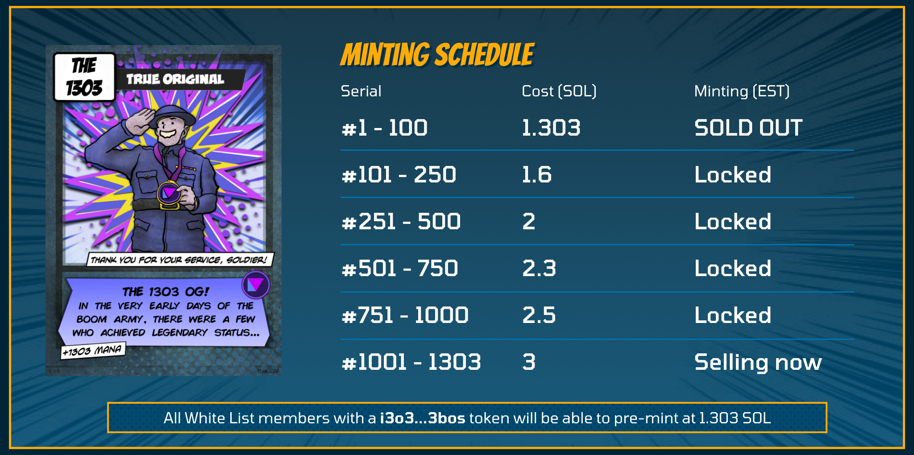

# The 1303 OG NFT

To commemorate the official launch of Boom.Army Beta, we're launching 1303 OG NFTs for everyone who is early. There are 1303 NFTs available, and they will receive a 1303 split share of 20% of our Market Place fees in perpetuity. You can mint them at [app.boom.army/mint-nft/1303](https://app.boom.army/mint-nft/1303).

## 1303 NFT Benefits

- 1303 split share of 20% of our Market Place fees in perpetuity
- First on platform Community DAO channel
- Bragging rights of being the first members on the first Solana Social platform

## White List tokens

All White List i3o3...3bos tokens mint at 1.303 SOL discount. All our Community Moderators in Discord have White Lists tokens to give away and you can [contact them if you need one](https://discord.gg/PmCNkDU5jJ).

## The 1303 token rarities

There are 4 different rarities of 1303 OGs, and they mint at increasing amounts as the time preference runs out:

| Serial       | Rarity     | Original Cost (SOL) |
| ------------ | ---------- | ------------------- |
| #1 - 100     | Legendary  | 1.303               |
| #101 - 250   | Ultra Rare | 1.6                 |
| #251 - 500   | Rare       | 2                   |
| #501 - 750   | Rare       | 2.3                 |
| #751 - 1000  | Regular    | 2.5                 |
| #1001 - 1303 | Regular    | 3                   |

> NB: All rarity tiers receive the same split share of market place revenue.

## 1303 Road Map 1Q22

Based on activity, I'm pretty sure when the switch flips on the 1303 NFT it's going to be a quiet start. We've got a community of 131 OGs now though, which is the foundation of everything we're about to do from here. In my mind it has been wildly successful to date, because all of the people I've been chatting to who have bought an OG are absolute ALPHAS. You are our kings and queens, and I want to make sure you're treated like royalty with everything we're about to deliver. The first thing I want to make sure of, is that the NFT you just bought increases in value and utility. So I'm going to keep the 1303 Ultra Rare NFT untouched until a day or so after our Monday Spotlight on MonkeDAO's twitter space to talk about the 1303 NFT project and what our goals are. We're going to keep spreading the word (and our community has been helping hugely with this on Twitter and Discord 🙏 ), but once a single NFT in one of the tiers hasn't sold for 8 hours, I'm going to mint the remaining OGs in that tier to a [Boom.Army](https:boom.army) account, and then lock them up. I'll then release the next tier of slightly less rare 1303 OGs, and follow the same process waiting 8 hours. I'm predicting we might end up with somewhere between 2-300 individual OGs minted and Boom.Army will hold the remainder of 1303 OG NFTs locked for future use. 

## Final thoughts

This community is going to be legendary. We'll use the locked NFTs we hold to run promotions and campaigns, and I'll set-up a market place on Magic Eden where only a few NFTs will be listed at a floor of 10 SOL and 1 Legendary will be listed at 1303 SOL. Once our market place is ready, I'll remove any OGs from ME that are still listed and put them onto Boom's Market Place and ALL our 1303 OG NFT holders will start to see the split share of 20% MP revenue rolling into their wallets.
