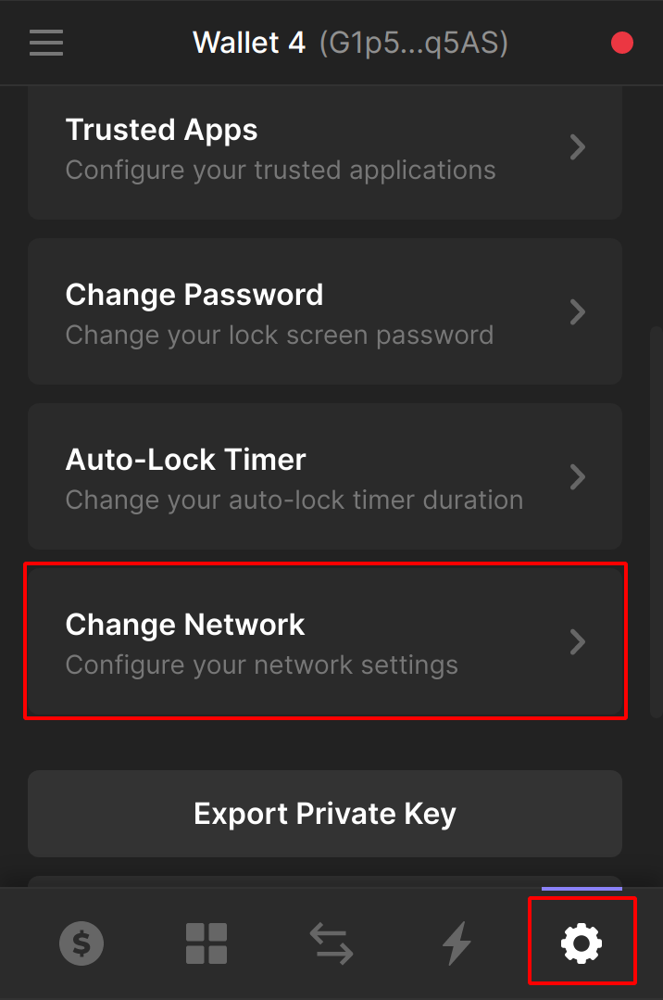

# Sosol Alpha

Welcome to the 1303, and thanks for your interest in [sosol](http://sosol.app).

** Alpha is live!!!**

TLDR; - Head over to [my.sosol.app](http://my.sosol.app) and you'll be able to login using the wallet specified when you registered.

**NB - you'll need $SOL on test-net to pay the tiny network transaction fees. You can get [as much as you need for free here](https://solfaucet.com).**
## What to expect

Alpha is in the [earliest stage](https://en.wikipedia.org/wiki/Software_release_life_cycle) of the software release cycle. Many of the packages we're using in the code base are only partly formed. This is how early you are! Expect features to be generally a bit lack-lustre, and in the odd instance to be broken. If you do find something that isn't working, or have a suggestion, then please jump on twitter and let [@harkl_](https://my.sosol.app/harkl) know. Alternately, if you're a little bit familiar with github then please do log an issue right in the [client repo](https://github.com/sosol-gmi/sosol-client/issues).

Just remember Twitter has built their platform over 15 years, while sosol has been in development for just 4 short months so far. Please go easy on us. As we build up the team, and start getting a road-map together things will get better and better. And because we're monetized from the start I have no doubt the token will reflect how well the product is doing at each stage.

## Transactions

This is by far the best part of sosol, and also the part that introduces a brand new social paradigm in the form of Web3. Currently there is a single piece of functionality where this is enabled:

- Emoji reactions: cost for interaction = 0.1 SSL

As we do more development more and more transactional interactions will appear. But at the moment what we're most interested in is proving the concept.

## The detail

Here's the skinny on what alpha means exaclty, to serve as a guide and set expectations.

### The airdrop

We've dropped 1000 $SSL on Testnet to every person in the Alpha Program. With emoji reactions costing just 0.1 SSL, that will give you 10,000 transactions. But remember you'll be earning SSL from people adding emojis to your posts, so if you're popular your balance will go up. It should create a circular economy, where folks who are providing the most content value build up the most tokens over time. So spread those gmoots around people 👌.

**NB - you'll need $SOL on test-net to pay the small transaction fee. You can get [as much as you need for free here](https://solfaucet.com).**

There's a total of just 42,000,000 sosol tokens, so that means you own 0.002% of the total supply! If you had the equivalent total supply in $BTC that would equate to $23.5M USD at it's current price of $62,283.29 USD. That absolutely blows my mind and is obviously not a promise of future value, but it's wild to think about all the same.

### Test Net

Alpha is being run on Solana [Testnet](https://explorer.solana.com/?cluster=testnet). This gives everyone the opportunity to play around as much as possible without any fear of losing real value from their wallet. And it allows us the freedom to make mistakes at this very early stage without too many serious real world consequences.

But please be assured, that when it comes time to launch beta, all accounts will have their tokens transferred over to main-net. 

Also remember that your wallet address will be the SAME on both Testnet and Mainet.

### Phantom wallet

[Phantom wallet](https://phantom.app) is awesome, and it is the only wallet available for use with sosol currently. This was a technical limitation rather than a conscious decision. More wallets will be coming as our development road map gets going.

To view your testnet balance, you'll need to go to your Phantom Wallet Settings by clicking the gear icon in the bottom left and changing your network.

## Our servers

Our servers are built to scale, with a load balancer and up to 200 t2.micro containers available if we get load. Having said that the guy who set them up is a bit of a DevOps amateur, so there could be a bit of disruption that may need to be ironed out early on. Please be assured that we'll always do our best to provide the best service and be transparent about what's going on. You'll be able to follow all tech support notices via [Twitter - @sosol_app](https://twitter.com/sosol_app).

As we've been very vocal about, the future of sosol is on the decentralized IPFS network. We currently have the token mechanisms setup to incentivize this in future, but it will be a little while before we get to that stage. Given the primary database client [Orbit-DB](https://orbitdb.org) is also still in Alpha, you can get a picture of how early and new everything is in the crypto space.

## If you need anything

As you're well aware by now everything is bootstrapped, so if something seems off get in touch with [@harkl_](https://my.sosol.app/harkl) via sosol. The ultimate goal of SSL for the 1303 is to reward you all handsomely, and listen to your feedback to build the best Web3 Social product in the space. LFG!
