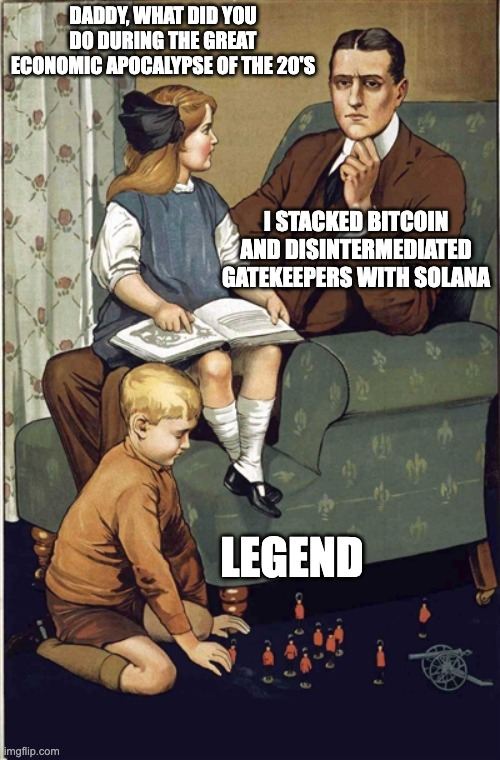
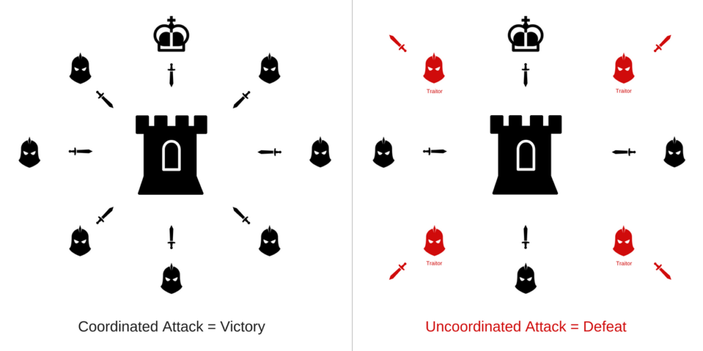

Never a dull week in Solana. With the advent of Aptos, all the ruggers, shillers and grifters jumped ship basically overnight and suddenly there was a beautiful calm across the ecosystem. Many cried out in FUD - the ones who relied on these sorts to pump their bags. But the OGs always realized that those bags had no utility, and the day of reckoning always comes for the ones who lie, cheat and steal.

But we, the ones who know the intricacies of markets and macro-economies who have been crying from the watchtowers for the longest time are not shaken. We know that all of this too must pass away in the great reckoning. We must journey into the depths of Winter where many will freeze, but the shining light of the human spirit will rise once more against the spectre of adversity. And we will be reborn in the advent of Spring, when the first shoots of new macro push up though the soil to be seen and realized by all. Even though we knew all along they were there, being fed and watered by our tireless work.

## The Big Picture

If you zoom out and keep focused on the bigger picture you will realize this is still the greatest opportunity to setup generational wealth since the advent of the internet. Blockchain is still something new under the sun. An extraordinary premise really when you start to take that in. It solves The Byzantine Generals problem meaning that we can now guarantee consensus in a transactional environment. The requirement for a 3rd party authorities is no longer necessary and it couldn't come at a better time in history.

> Know the enemy and know yourself; in a hundred battles you will never peril.

- Sun Tzu

Many of the institutions that were once regarded as 3rd party authorities of integrity and trust capable of governance, have in a very short time shown themselves to be anything but. Driven by the information age, people are able to access raw data and unsanctioned media in a free contest of ideas that is often diametrically opposed to much of what these same authorities are telling us. And it extends to all sectors as the general breakdown of culture in the West through rejection of Christianity and it's principles has shifted the needle towards relativism, greed and selfishness.

## Our Malady

Faced with this information there are two choices: stay in the safety and comfort of the group and their media sponsored group think; or push forward into the discomfort of being faced with competing ideas and apply critical thinking to the best of your ability. There is no inbetween, and although voluntarily taking this challenge on is exhausting and often demoralizing, it's a shadow of the difficulty that will come from being unprepared in the face of the market collapse once the inevitable black swan event rears it's head.

TLDR: cheap credit is not coming back, and MANY have over-extended themselves.

So what is the antidote? It's the same as it's always been. God, Family, and Community. There is no substitute for these three things and everything flows out of them. This is the ideology that I'm building Boom with. The HOW is a much more nuanced conversation because it's a winding path with multiple ingress and egress points. But we are all still early, and the best is yet to come in spite of the worst.

Until we meet IRL - [harkl_](https://boom.army/harkl)
