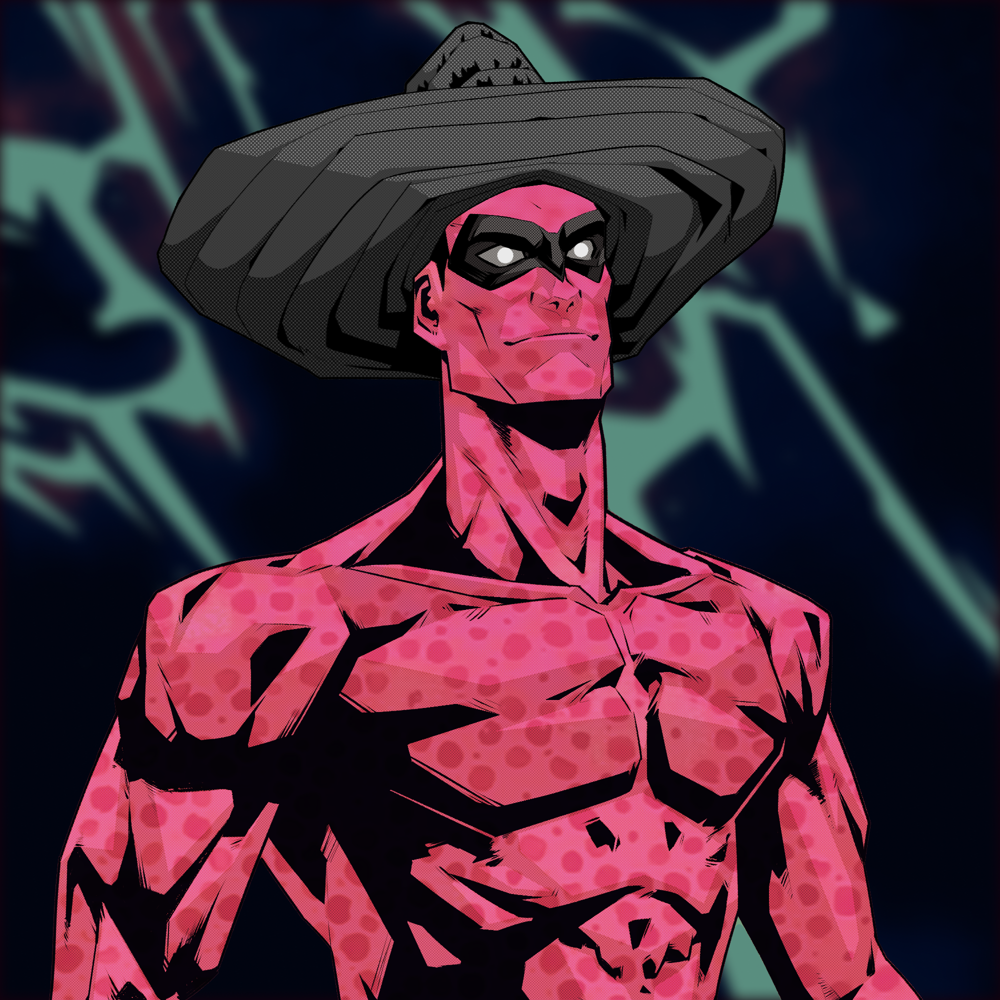
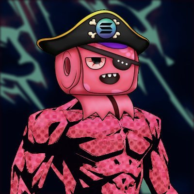

Two weeks ago we launched Boom Heroes.

It was a bit of a mad rush to hit the April 15 deadline for the [Boom Hero NFT mint](https://boom.army/mint-boom-hero), and over a single 14 hour day all the work was completed to build the traits into 4677 images (more on that number later), loaded the Candy Machine, verified all the image files, rebuilt the launch page on [boom.army](https://boom.army), and launched the project.

Since then my day job ramped up and we had a crazy busy period where an upgrade of the large platform I'm responsible for caused a whole raft of [NPM](https://www.npmjs.com) package compatibility issues. So I've spent next to no time on Boom over the last 2 weeks. But all those problems are solved now (I have an amazing team), and I'm back full steam on Boom now.

## Market Place Update

The Market Place UX is built! The remaining work to do is take the [Metaplex](https://www.metaplex.com) Market Place libraries, and integrate them into the UX. I'm yet to dig into these specific [library methods](https://docs.metaplex.com/auction-house/definition), but they're well documented and widely used. Metaplex is basically single handedly responsible for the entire success of the Solana NFT space. There's not one NFT or MP project I know of that hasn't used their tooling to get up and running.

By far one of the things I'm most excited about is looking at the new Escrowless listing feature that Metaplex have built. This feature is going to allow you to list your NFTs on Boom.Army and keep them in your wallet! It also means that you can list them on multiple MPs, and show them off on any [Profile Page](https://boom.army/harkl) that connects with your wallet and has a gallery. Much like the Profile page on [Boom.Army](https://boom.army)!

## Custom NFTs

In the few hours I've had to work on Boom since the last update, I've shipped a whole bunch of new command line methods for the [Ghetto Air Drop tool](https://github.com/h4rkl/Ghetto-SolAir) that was built to bulk airdrop [$BMA](https://birdeye.so/token/boomh1LQnwDnHtKxWTFgxcbdRjPypRSjdwxkAEJkFSH) tokens and NFTs to people we needed to send them to.

This is because while we're building the last features into the Market Place, we're going to start creating 1/1 Boom Heroes for all the active OGs on Boom Army and in Discord. You might have noticed that the Candy Machine launched with 4677 Heroes loaded up. So we've got scope to send 100 custom heroes to close Community members to bring the final total to the 4777 target. Those of you who have been around for a while know that I'm big on rewarding Community involvement. And we've got such a great bunch of people who believe in the project I'm going to continue to do that, so this is just another way to show the love. Who knows, maybe one day the perks will get to a level where we'll all be able to sell a few Boom Heroes, and meetup in the Bahamas on a private beach somewhere for sunset cocktails? But for now we're still small and humble.

The other 1/1 [Boom Hero NFTs](https://boom.army/mint-boom-hero) are going to be sent out to influencers around the Solana space. One of the greatest things about on-chain transactions and searchable NFT traits, is that it's pretty easy to track down wallets. For example, here's [Shaq's Solana Wallet](https://solscan.io/account/gacMrsrxNisAhCfgsUAVbwmTC3w9nJB6NychLAnTQFv) that I used his DeGod he recently purchased to find. If any of you reading this have suggestions of which influencers we should track down, HMU on [Boom Army](https://boom.army/harkl) or jump into our [Discord](https://discord.gg/RqbcwKphDr) and shout out.

The first 1/1 we've made was for [@fordudesake](https://twitter.com/fordudesake). He's a pretty awesome NFT derivative maker, and long time Solana Community member. An all round nice guy too.

If you jump onto Twitter and look at his profile picture he's already done a pretty great derivative. 

Feeling cute, might do a collab with [@NFTeePeeClub](https://twitter.com/NFTeePeeClub) later.

## Arweave Image Uploading Tool

One of the things that has fallen out of building the 1/1 NFT creator, is the realisation that currently in the ecosystem there's no simple way to connect a Solana Wallet to a website, and then pay to upload images to Arweave using the same wallet. I'm interested to hear back from the community on this, but I'm thinking we can have a tool directly on [Boom.Army](https://boom.army) to do this where people can pay in [$BMA](https://birdeye.so/token/boomh1LQnwDnHtKxWTFgxcbdRjPypRSjdwxkAEJkFSH) for this service. We haven't added a lot of utility to the [$BMA](https://birdeye.so/token/boomh1LQnwDnHtKxWTFgxcbdRjPypRSjdwxkAEJkFSH) token at this stage and the idea is that we'll start doing this more and more with features along these lines. It seems like something that would be really useful for people.

## Twitter Ban

We've been chatting on Discord this week about our constrained [Twitter account](https://twitter.com/boom_army_). Ever since our Twitter ban late in 2021 we've suspected that our account has been limited in what is showing, because our follower count was going up at about 20-100 per day and basically fell of a cliff overnight. It's never recovered, and most of the content we're posting these days gets liked by the same group of 20-30 people.

The plan is to resolve this by creating a new account and then duplicating content between them. We're in the process of doing this so stay tuned and we'll let you know when we launch. It would be great to get our core OGs following right off the bat.

## I Need Help

I'm a serial startup guy and have learnt over the years that while I can do most things on the technical side, I'm absolute terrible at two things:

- Marketing
- Delegation

So this is a little section to apologise that we're not growing as fast as we probably should, and also if you know any killer marketing people who are have a track record of success in web to send them our contacts. The delegation issue will be solved once we've got enough cash flow to hire a scrum master and fund a proper dev team. We do have a few devs who are doing basic work, but no real heavy hitters who can build out Solana functionality. So it's all on me for now.

Until we meet IRL - [harkl_](https://twitter.com/harkl_)
