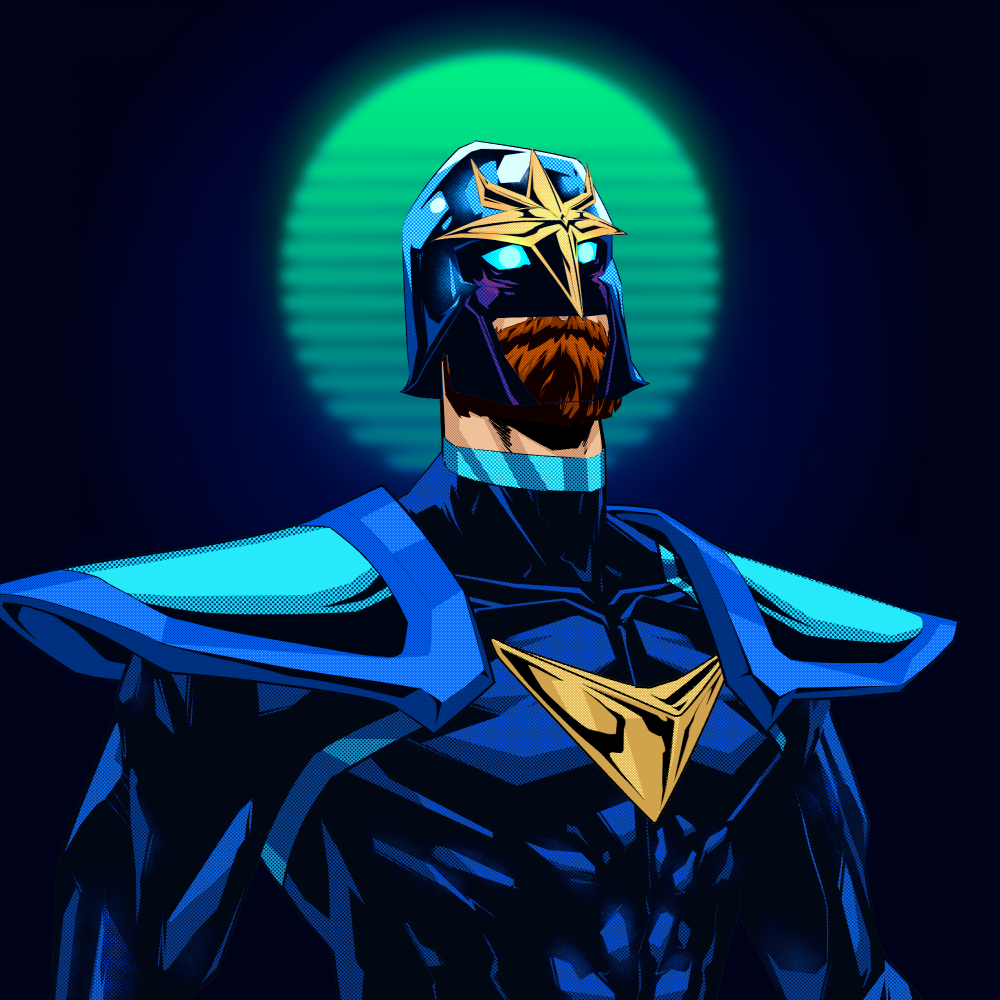

I'm currently working on the MP build with another dev and in the downtime between code reviews I've also been able to deliver
some serious upgrades to the platform.

## Upgrades

The upgrades delivered include:

- React v17 to v18
- Added Glow Wallet integration
- Added Slope Wallet integration
- Material UI Library (MUI) from v4 to v5
- Upgraded the Snackbar messaging across the site to MUI
- Added reply status to the NFT Messaging Channels

## Glow Wallet

We're currently in the process of helping out a fellow Solana Community member who is doing a screencast of how Glow Wallet works. 
He's going to be using Boom Army to demo the login process, so as part of the integration we had to update a bunch of libraries. 
I'm personally really looking forward to seeing it and will make sure to post a link on Boom Army once it is live.

You can [read more about in this Medium Article](https://medium.com/stakingbits/glow-wallet-for-solana-the-most-user-friendl-ea0d255a9ab2).

## Slope Wallet

We've had a lot of requests for [Slope Wallet](https://slope.finance) integration and I'm really pleased to have been able to finally deliver it. 
Ultimately the more ways of connecting the wider our Community can reach. So it's all positive news.

## 1/1 Boom Heroes

We're slowly rolling out 1/1 Boom Heroes for frens and celebrities. Here's the latest one. It's our take on a Space Cop hero.
Sporting a rare Ginger Beard too! We'll leave it to the recipient to DOX themselves :)

