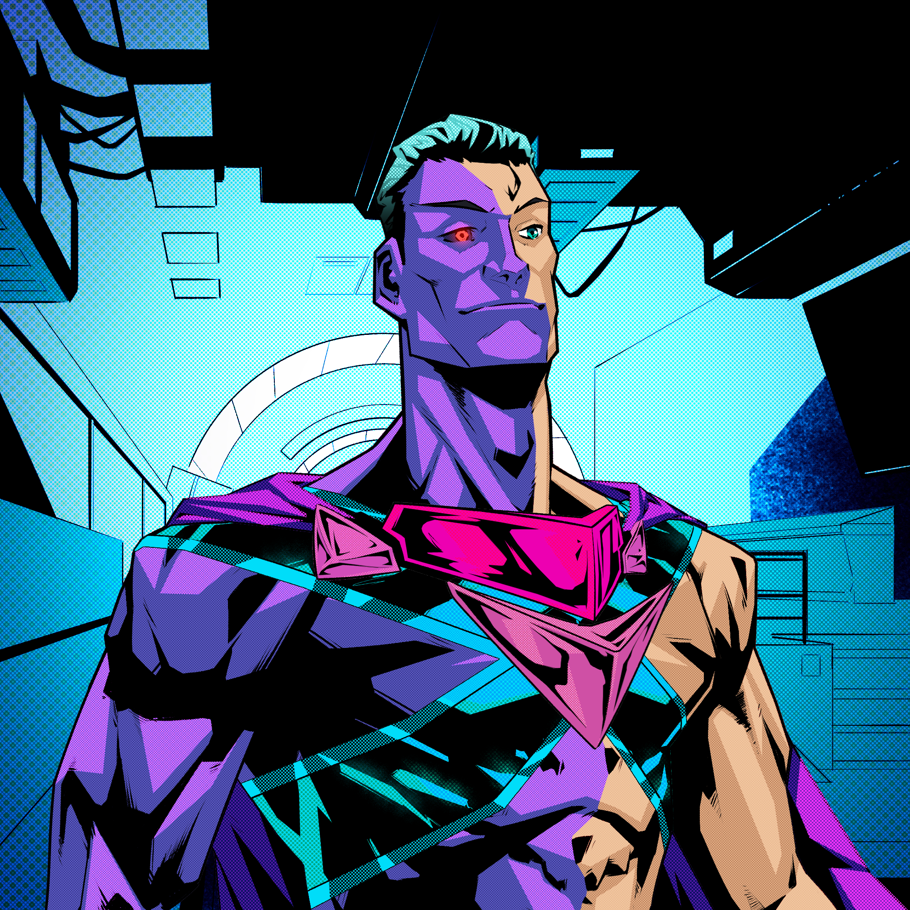
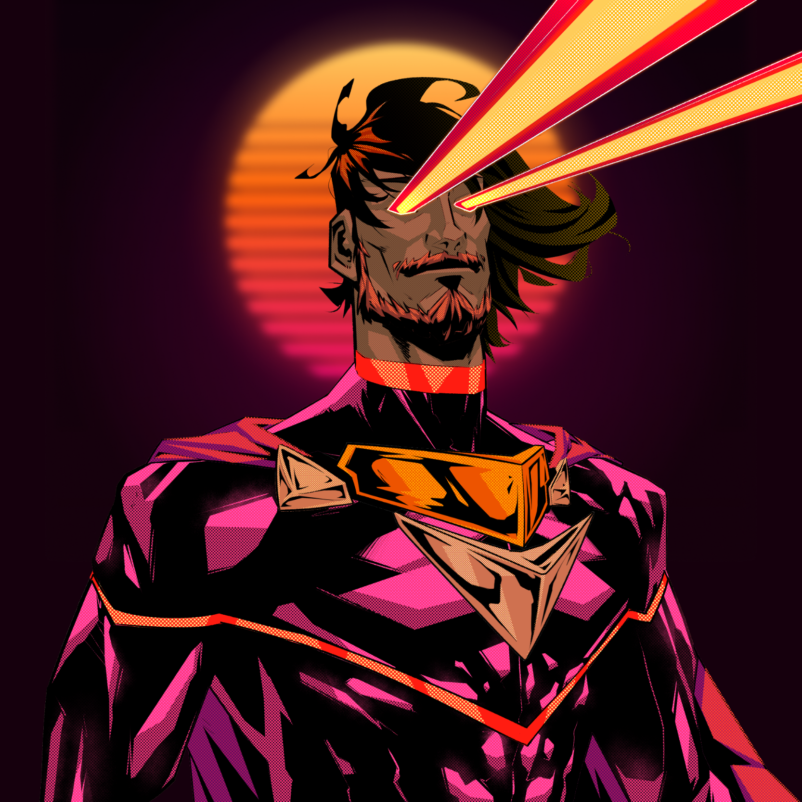
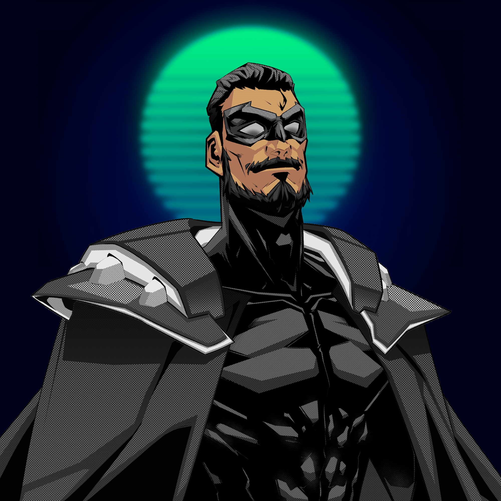

While the market has been on fire, I've been quietly getting on with building.

Here's the things Boom has delivered since the last update.

### Updated the entire Candy Machine v2 platform

The Candy Machine from Metaplex received some heavy upgrades (many with breaking changes) so I dug into the codebase and upgraded the whole thing. It was a sizable job but now the Candy Machine has bot and spam protection. I'm hoping one day we're going to need this, but until that day happens I'm going to keep on quietly building and delivering value to the platform for our faithful community. 

### Added rich links to posts

An essential feature for sharing content pulling the Metadata from links is really important to meet the expectations of any standard web based social experience. This now work for pasted links on [Boom Army](https://boom.army), and the next thing to do is to serve Metadata from the server for pasted links from Boom Army on other sites. Paste a link into a post and try it out.

## BMA token

Some people have been watching the [$BMA token price](https://birdeye.so/token/boomh1LQnwDnHtKxWTFgxcbdRjPypRSjdwxkAEJkFSH) fluctuate and speculating what might be happening.

**TLDR;** We're yet to add any real utility to the token and both the volume and liquidity are really low so it doesn't take much to shift the token price.

The longer explanation is that we've got an ex team member who was paid in $BMA for the work they did for us, and they're drawing down the liquidity which is shifting the price down. This isn't on them, the markets are tough at the moment and a lot of people are looking for liquidity so it's understandable that they'd want to extract the value from the token for the work they did. 

Unfortunately because the core token utility at the moment is on platform tipping, there's not much USDC volume flowing in, and the lion share of USDC volume is flowing out. So this is driving the price down. It's a great lesson on why utility is king, and every project needs it for when the hype dies down.

We are adding a huge amount of utility in the near future which should reverse this somewhat - namely the Market Place which will transact in $BMA, and several other smaller pay to use features. Not to mention our uber play around promoting posts which you can read more about in our [Whitepaper](https://linktr.ee/boom_army).

In short, people will get plenty of notice when these deliverables are going to get pushed to production, but until then the token price could drop a lot further from where it is now. I'd warn anyone trying to jump in that it is likely to continue to be highly volatile, and to wait until there is real utility attached before swapping any meaningful amount of USDC for BMA.

Farming the BMA-USDC pair on [Aldrin](https://linktr.ee/boom_army) is probably the best play at the moment as regardless of the token price you'll maintain a decent share of the pool and can remove that share at any time without affecting the token price itself.

As always, none of this is investment advice and you should always do your own research before committing capital to any project. Regardless of how much of a degen you are!

## Market Place build update

The MP build has been coming along well, but we've spent the last week ironing out some quality issues with a developer we had working with us. These have been resolved and although they slowed us down, we're still well on track for delivery. We're just a bit behind schedule.

## 1/1 Boom Heroes

We cranked out 3 more custom Boom Heroes for our faithfuls this week. Here they are for everyone to see. If you've been with us since we were known as Sosol, and are a regular contributor to our [Discord](https://linktr.ee/boom_army) and [Twitter](https://linktr.ee/boom_army) then you need a custom Boom Hero. Hit up Flamulus in our [Discord](https://linktr.ee/boom_army) and he can sort something out for you. He'll be creating customs for the whole of May.

### Drowxes

### Abdul

### Raj Gokal

Until we meet IRL - [harkl_](https://twitter.com/harkl_)