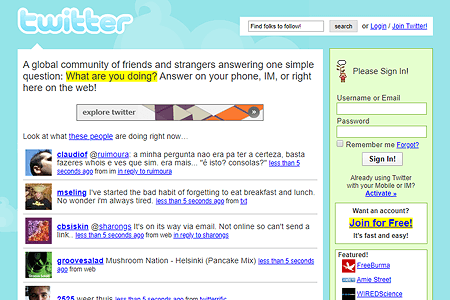
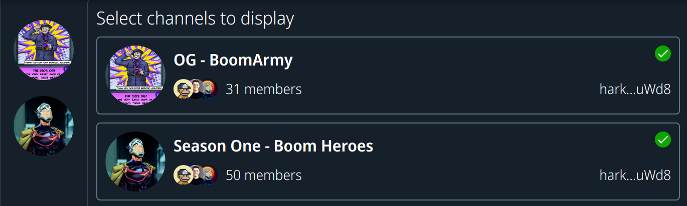
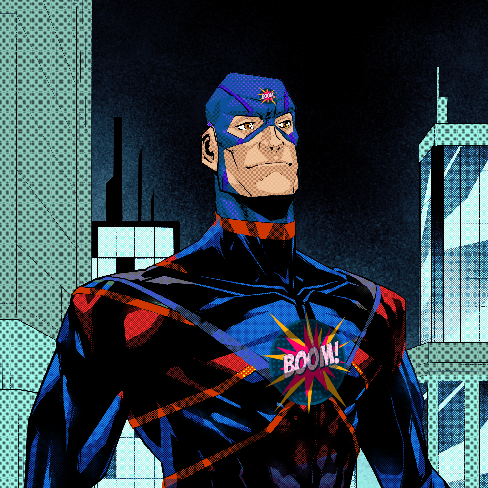
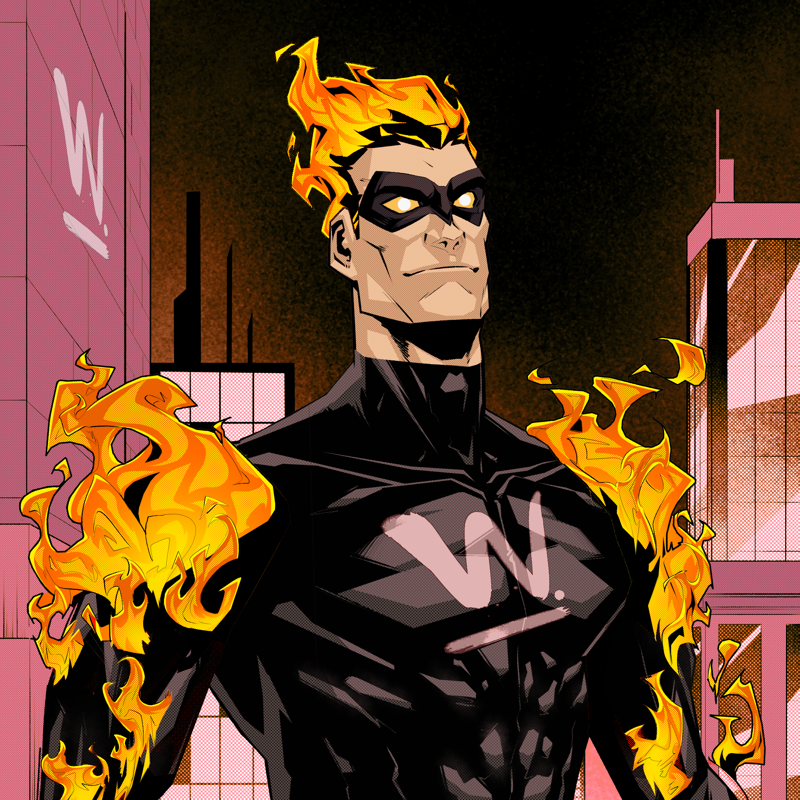
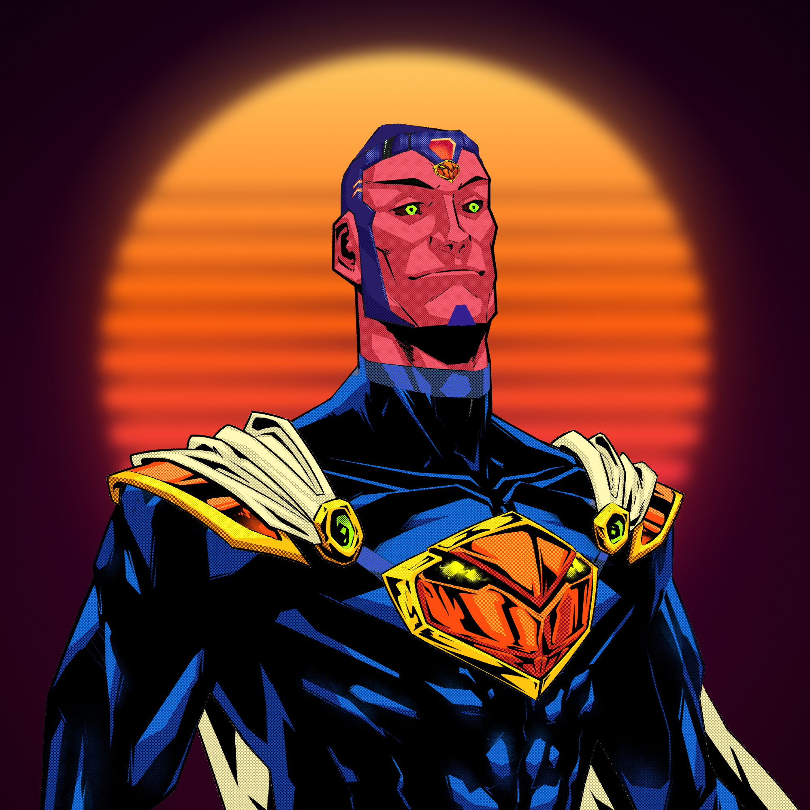

We've just ticked over 22k posts on Boom Army which is a pretty big milestone IMO.

This release sees enough updates to warrant a new minor version of the platform, and we're now at v0.6.0. Here's the things Boom has delivered since the last update.

## News feeds are LIVE!

How hard is it to keep up with what's going in the Solana space? Really bloody hard given that a week seems like a year. But not to worry, we've got your back fam. We've been scouring the web for the best Solana content and news and now you can see it right in the global feed without having to even leave [Boom Army](https://boom.army). Just one of the many benefits of being a Social First platform built right on the Solana Blockchain. We've launched with 5 news sources and over the next few weeks we'll keep adding them so you never miss-out on the latest Alpha.

I'm especially looking forward to building out a Spanish language specific news feed for our very own [@Drowxes](https://boom.army/Drowxes) who runs the awesome [Codigo Cyphex](https://codigocyphex.com/) blog. We :heart: you bro.

## UX update

I've made some big updates to the UX and improved the user experience. A lot of the time spent on any app is in polishing up the UX. We've got quite a bit of functionality on platform now. With the news feeds that have been added in v0.6.0 it represents another step forward in quality and UX. We'll continue to improve, and don't forget that everyone starts somewhere and we're still only several months in since we started. Here's what twitter looked like around the same timeframe:

## Video Embeds

You can now view videos from all platforms right in the [Boom Army](https://boom.army) feed. Here's one [posted a few days ago](https://boom.army/bergfalk/status/cl3chbym8694501msfickuqao) by our very own [@bergfalk](https://boom.army/bergfalk).

Head on over to the app and post your favourite video link in a post with a bit of commentary. I'll tip my favourites over the next few days.

## Channels

Our Boom Native Telegram like Channels secured by NFTs are slowly coming along. There's a bit of sporadic activity but we definitely still need to implement:

- Push notifications
- @everyone notifications
- Channel settings and notification management
- Channel sub-topics and sub-types (just imagine an NFT gated sombrero chat!)
- `<handle> is typing...` functionality

The existing functionality with replys, auto-updates of the feed and in-app notifications is doing a reasonable job to prove the concept that NFTs can provide an access gate for secure chat. Probably why we've got 50 people in the Boom Heroes channel ready to go. Things will only get better from here.

## Public profiles

All profiles can now be viewed without having to connect a wallet to [Boom Army](https://boom.army). Now you can show off your NFTs to anyone and everyone by simply pasting the link to your profile up for them. At some stage we'll also give people the ability to toggle this feature on and off but for now, just like the blockchain it's all open and transparent baby!

## Custom 1/1s

[@Flamulus](https://boom.army/flamulus) has created some more awesome 1/1s and they aren't minted yet, but it won't be long until they're sent out to a couple of our faithful fans:

### Captain Moona-boom

[Moona-boom](https://boom.army/Moona-boom)

### Hitman

[Hitman](https://boom.army/hitman)

### Nacho

[Nacho](https://boom.army/Nacho)

Until we meet IRL - [harkl_](https://twitter.com/harkl_)
