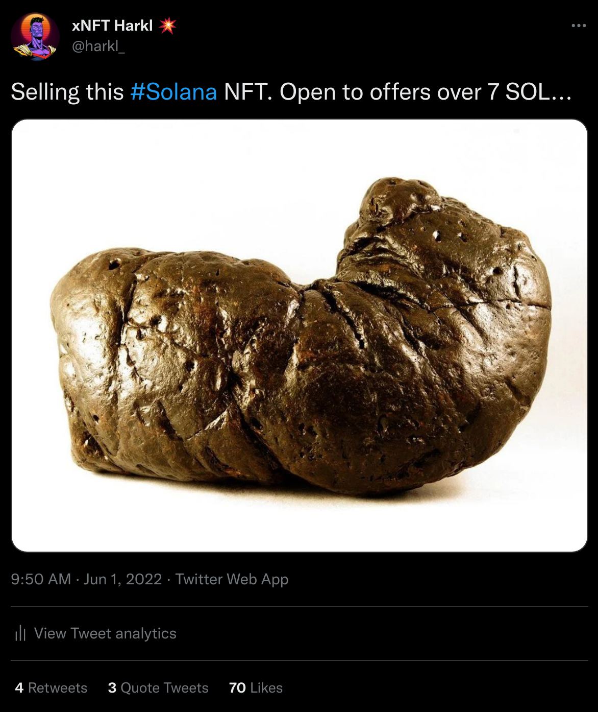
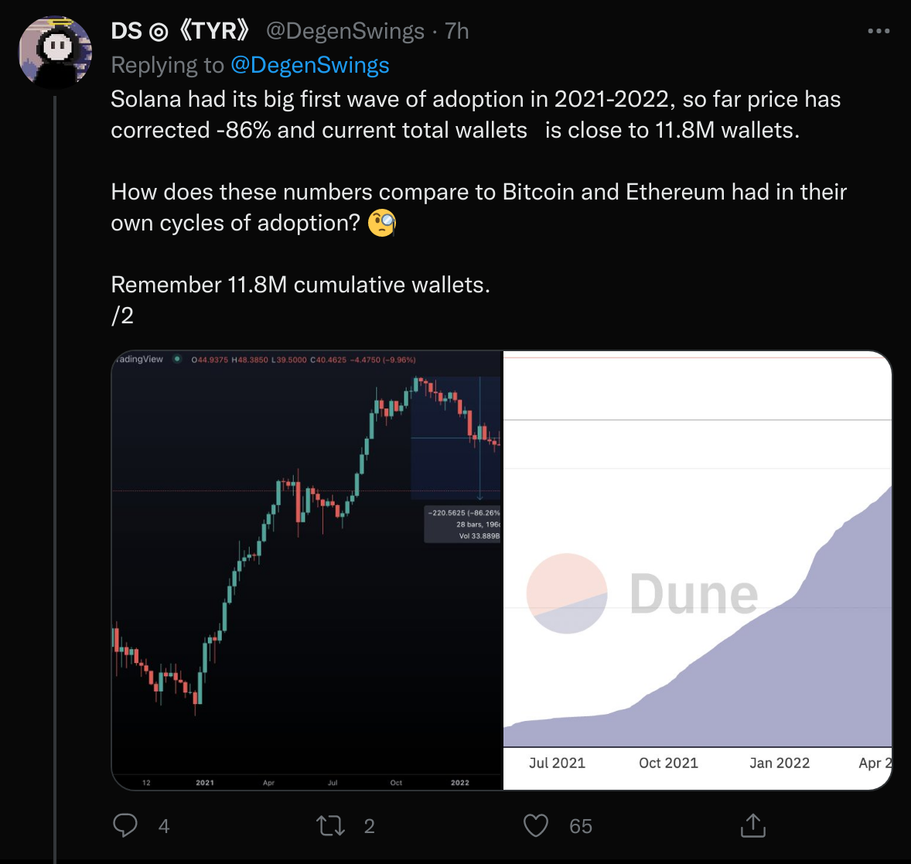

## The state of NFTs and Solana

Add to this the number of [low quality](https://twitter.com/harkl_/status/1531754907212324865) and [knock-off](https://twitter.com/Not_OkayBears) NFT projects that have crowded into the space in the same timeframe, and it makes for a boiling pot of pretty nasty proportions. It's the sort of environment where you get to see the true colors of a community and the report card isn't looking good. [Take this tweet](https://twitter.com/harkl_/status/1531754907212324865) I recently posted which somehow got more likes and engagement than most of the web3 Social Media Glass Chewing I've done in the last month alone. It's really a sorry state of affiars.

On top of that the network has been really unstable and has crashed several times. In this instance it's important to realize that Solana Mainnet is still in beta, and when it comes to software development bugs in production is a given. It's how you deal with them that is everything. And according to [@DegenSwings](https://twitter.com/DegenSwings), there's good evidence that Solana is going through a cycle [which other networks have seen before, Bitcoin in 2013 and Ethereum in 2017](https://twitter.com/DegenSwings/status/1532115994348425216?s=20&t=Or6IQeWQ53unArennTRUZQ).

Whatever the case, I'm still bullish on Solana, NFTs, and the community who are here for the tech first rather than 1000x gains.

## State of the Market Place

I'm pressing the pause button on the Market Place (MP) even though it's 95% complete. Over the last week I've taken time out to think about where Boom is headed, what features we're delivering and the whole MP delivery hasn't been sitting right with me. I've come to the conclusion that we're running the risk of bolting on another new feature that really isn't solving any demand problem. And at the same time our existing functionality is being neglected rather than improved. I think Boom is much better placed to massively upgrade the functionality we have already and so I'm going to down tools on the MP and pour all my efforts into the existing infrastructure.

In light of this the [RoadMap](https://boom.army/docs/docs/prologue/roadmap/) has been updated to reflect the current state. You'll see the MP is still part of the bigger vision, we really just need to get the core functionality as good as it can be first before we deliver it.

### What this means for Boom

Expect to see the content on platform vastly increase. Boom has built a really good container for high frequency content delivery and we're going to be pulling in the best aggreated feeds and data from around the space. As a result of the improvements we've made over the last 2 weeks, Boom has seen a 400% increase in request volume. This is the UX we're going to double down on improving. The goal is that if you want to get up to speed with what's going on in the space in 2 minutes, we are the number one place to go.Then if you want to discuss that content with the best and brightest, the feeds and breakout channels are right there alongside full of quality discussion.

## Funding announcement

In April we were funded USD 100k by [Big Brain Holdings](https://www.bigbrain.holdings). We've hinted on this generally before, but this is the first time it's been announced. It is a real privelege to be funded by Big Brain, and I consider them to be one of the smartest investors in the space. You only have to clock the alpha coming out of the [Big Brain account](https://twitter.com/SOLBigBrain) to understand how smooth an operator Big Brain is.

Comparitive to many other projects seed funding round it's a relatively small amount of investment, but the progress that Boom has been able to make on a shoe-string budget like this is actually collosal. It's proof of the future quality and volume we can deliver. So far we've spent just over half of the allocation, and with our current burn if we receive no further funding we can continue to deliver at the speed we've been going for 2 more years. Ideally we're hoping to do a Series A round once we've got a demonstratable revenue model built. But until that happens we will continue to deliver at the current velocity and you can be assured we're in this for at least that timeframe. We take a very long term view of the space.

**Here's what we've delivered with the funding in the last 2 months:**

- NFT secured chat
- Mint your own NFT functionality
- Mobile UX
- Solana News feeds in global
- Funded the #BoomHeroes mint
- Paid for a Social Media Manager
- Paid ongoing hosting and infra costs (we still have 2 years of run-way left for this at current burn)
- Vastly improved UX across the board
- Added Glow and Slope Wallet integration
- An audit of the $BMA Program Contract

So, if you're a VC looking to invest in or lead a Series A round for a mature project in the Solana ecosystem, then please reach out. We're open to discussion.

## We're still chewing glass

While we're crushing it on the tech delivery side of things, there's still a few areas where we're really struggling.

### Boom Heroes NFT capital raise

We didn't raise as much as we hoped with the [Boom Heroes NFT](https://app.boom.army/mint-boom-hero) and the whole NFT market place is generally [pretty saturated at the moment](https://www.investing.com/analysis/solanas-nft-market-gets-crowded-6-sellers-for-every-buyer-200625148).

### Marketing and product fit are an ongoing challenge

We're getting better and better each week, but its immediately apparent we're still not crushing our product offering, and therefore marketing is a challenge. The best thing is we're aware of this though, and the update of the [RoadMap](https://boom.army/docs/docs/prologue/roadmap/) and reallignment of priorities is directly targeted at addressing this problem. After all, marketing is the price that average projects pay for exposure.

## Things delivered since last update

Last but certainly not least.

- Complete rework of profile editor
- UX overhaul of layout and container
- 21 news feed content sources added

Until we meet IRL - [harkl_](https://twitter.com/harkl_)