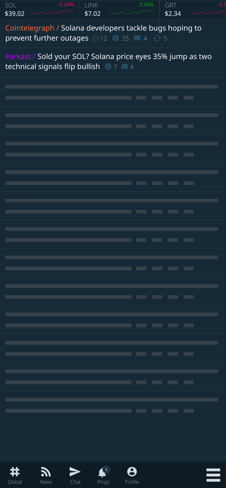
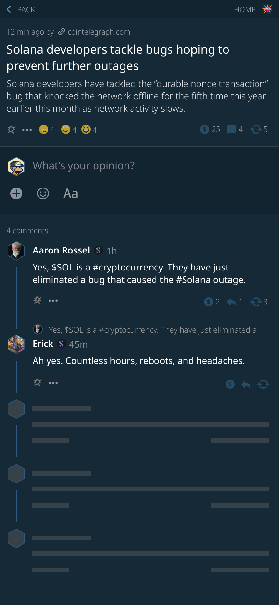

In the last 2 weeks Harkl has been working hard to deliver a bunch of Boom NFT upgrades.

## NFT PFPs are live

We've shipped NFT Profile Pictures. It's a simple 3 step process to use any NFT in your gallery as a PFP:

- Go to your Profile page
- Click on any NFT in your gallery
- Select "Set as Profile Picture"

[Check out a 1 minute screencast showing how it works in Kiwi Browser](https://vimeo.com/manage/videos/720922480)

## News Feed design

The news feed is great but there's so much news now it's clogging up the global timeline. [Boom](https://app.boom.army) is going to shift it to it's own "#news" section. The last week or so has been spent on design figuring out exactly how that works and here's a slide of what it will look like once completed:

You might notice that there's a whole string of Solana price tickers along the top of the page too. There's going to be some premium functionality added for our OGs so you can keep track of Solana tokens right in the app. Couple this with adding functionality to display more types of native Solana Programs directly in Meeps and you can see [Boom](https://app.boom.army) is really starting to get stuck into on-chain content.

## General UX Improvements

It's obvious that the site is in beta at the moment as there's still functionality that feels a bit clunky, namely threaded comments, and navigating between pages. We've been working on design to upgrade the whole feel of the site so you can click around and not lose your place. Add long format content meeps and a raft of other small but important improvements and you'll see that over the next few weeks the site will start to feel more and more useful. It may be a bear market but [Boom](https://app.boom.army) is consistantly delivering week in, week out.

### NFTs as a first class citizen

Part of the work done behing the scenes to get NFT PFP's working was to upgrade the way the site deals with NFT data. The new structure means [Boom](https://app.boom.army) can start to use NFTs more and more to secure different elements and gate experiences on the app. As we move more elements on-chain to Solana it will allow [Boom](https://app.boom.army) to provide a premium experience and utilize the $BMA token in combination with NFTs that our users hold for some pretty cool stuff. Watch this space!

Until we meet IRL - [harkl_](https://app.boom.army/harkl)