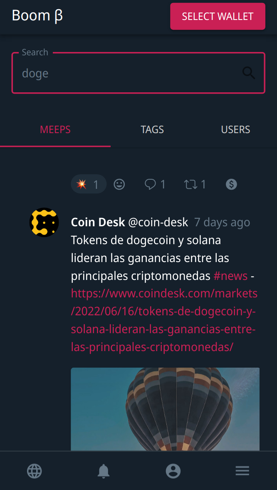
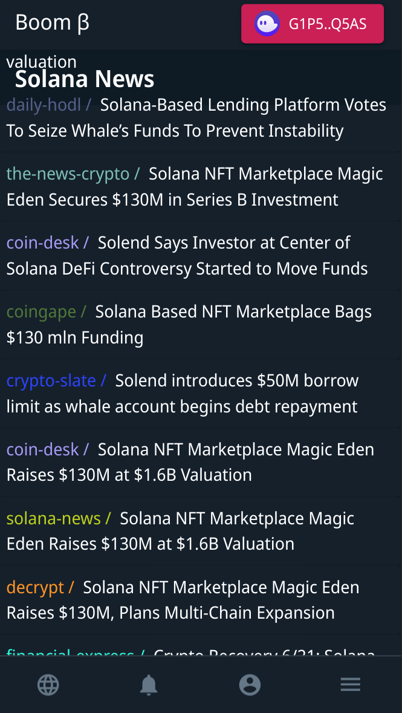

Two big new features were delivered this week, and the build delivery is picking up as we head into the end of the second quarter of the year.

## Search functionality

You can now search Meeps, Tags and Users on platform as a complete overhaul of the search functionality was delivered. It's fast and functional and was necessary to setup the architecture for our news feed which is essentially a filter on Meeps. The whole database design is pretty good in this regard as everything is a Meep regardless of whether it is threaded or not.

Search includes the ability to share search as the URL bar updates with every search. You can [see an example in this in action here](https://boom.army/explore?type=USERS&term=sol), and it's open to all without the need to connect your wallet and create an account.

## Solana news feed

[Boom](https://boom.army) delivered and built the dedicated Solana news feed this week. The whole thing was shipped in a single day of dev, and having a single place where you can check the latest news around Solana is really useful. As of writing there's 25 aggregated news sources feeding into the news page. Being able to comment, tip and react to the articles is also a great feature. A single place to discuss what's going on and as we improve the UX around commenting I'm hoping it will become a great asset to the whole Solana space.

### What's next for news

[Boom](https://boom.army) is going to be updating the existing Global Feed to a Boom Heroes feed. You might have noticed that the labelling on Global has changed to prepare for this. The new feed functionality will work as follows:

- Anyone with a Boom Heroes NFT PFP will have their posts show up in the Hero Feed

It will be our first premium feature of many to come.

## Boom Heroes mint is finished

The Boom Heroes mint was retired this week with just under 700 Heroes minted. You're going to be getting a market place listing for Boom Heroes in the next couple of weeks so you can start to trade them. Because there's so few minted it means they are a lot rarer than if they had all sold out. This should give people good opportunity to make some money from sales as we have no plans at this stage to release any more onto the open market. With the addition of the Boom heroes global feed, they will have real utility on platform too.

Until we meet IRL - [harkl_](https://boom.army/harkl)
