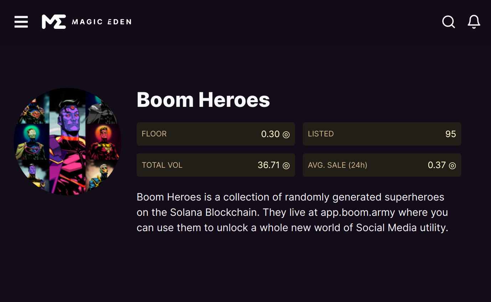
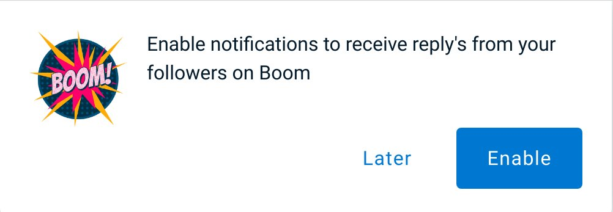

As the bear market ticks on we continue to build and upgrade features on the platform.

## Boom Heroes Market Place Live

This week we launched our [Boom Heroes NFT collection Market Place on Magic Eden](https://magiceden.io/marketplace/EJqr8VRC3rJaEVDDkcbG9G122ixW1GQ4f6y6vMwaGoco). The final collection count of Boom Heroes in the wild is 777. We haven't decided what to do with the remaining 4000, but for now it's as if they never existed as they're locked up and unaccessible in the Candy Machine and they'll stay there indefintely. With only 90 Boom Heroes listed as of this date it means as we get verified, appear on platforms like [Hello Moon](https://www.hellomoon.io) and start propagating on other NFT sniping tools we'll get more exposure. And as we continue to add functionality including the upcoming [Season Challenge's](https://boom.army/docs/docs/prologue/season-challenges/) and [Reverse Advertising Engine](https://boom.army/docs/docs/prologue/whitepaper/) the Boom Heroes should increase in value and become highly sort after. Given that they're specifically marked as a "Season One" pass, in all liklihood we'll generate a "Season Two" NFT rather than minting the remaining 4000 Season One Boom Heroes. 

## Notifications are Live

I've spent a whole bunch of time launching a proper notification platform on the app. Now, when you login you should be prompted to Enable Notifications and then allow them in your browser.

Notifications are currently enabled for:

- When someone @'s you
- When someone tips your Meep
- When someone adds a reaction to your Meep

This should increase the stickiness of the platform a lot. It's been one of the big missing features for quite a while. Already I've noticed the improvement when [@krishna](https://boom.army/krishna) messaged me and I was able to respond to him within 1 minute of the post being sent 💥. 

## Collabs

[Boom](https://boom.army) are actively seeking collabs at the moment to try out the Season Challenge structure. The basic idea behind a collab will be to:

- Create a unique upgradable n/n NFT with a limited supply
- Run a challenge on [boom.army](https://boom.army) for a limited time
- Have a leaderboard for the challenge
- Award prizes accordingly

We've got a couple of teams we're talking to at the moment, and I'm really looking forward to using the [Boom Heroes](https://magiceden.io/marketplace/EJqr8VRC3rJaEVDDkcbG9G122ixW1GQ4f6y6vMwaGoco) as a Season pass to engage and reward our faithful.

## Linktree

If you're new and want to find out about all things Boom including reading the Whitepaper and Roadmap then check out our [linktree](https://linktr.ee/boom_army).

Until we meet IRL - [harkl_](https://boom.army/harkl)