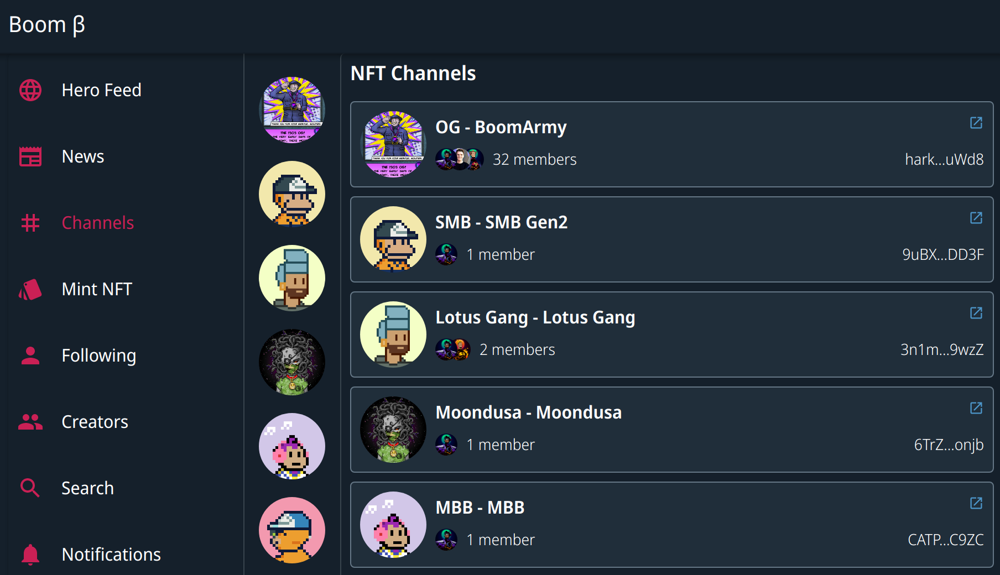
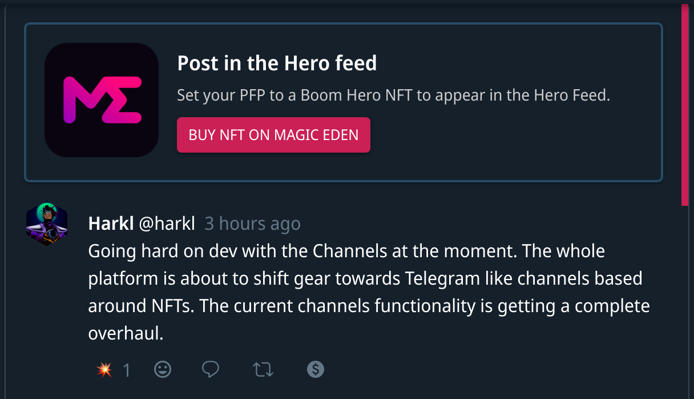
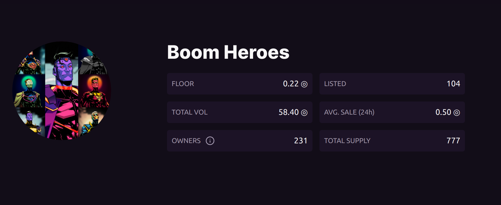

## Boom Heroes on Moonrank

You can now search through the traits and rarities of [Boom Heroes on MoonRank](https://moonrank.app/collection/boom_heroes). It's a fantastic tool.

## It's time to Pivot

Let's be clear - Boom is an ongoing experiment to figure out how Social Media works on chain with Solana. Rather than closing our doors and testing with a select group, we've chosen to open the gates and do everything in prod. This has meant that the feedback and success (or failure) of everything has been immediately apparent.

The key is understanding what makes messaging and connection different on Solana with Social. Boom has stepped through several stages on the journey so far to figuring this out:

1. To find out whether on-chain Social could integrate with a Solana Wallet
2. To see how a token transaction might integrate with Social on Solana
3. To see what sort of engagement tipping would drive
4. To see how NFTs could be integrated to provide a unique messaging experience
5. To find out what community elements worked with a branded NFT on platform

It's been a challenging road but I've been gathering the data and every week I know that Boom is closer to success.

> "The road to success and the road to failure are almost exactly the same." — Colin R. Davis

Based on this information I've deduced that we have three distinct verticals on our product platform. Read on to find out what they are.

## NFT secured messaging

The first is using NFTs as a secure gate to access Telegram like message channels. This is going to be Boom's core offering. As I've experienced being part of several DAOs over the last few months I've seen that they consist of some basic functions and these are what I'll be pushing into next on the roadmap for the Boom Messaging platform.

- A Messaging experience aligned with Telegram or WhatsApp secured by NFTS
- On-chain DAO voting integrated directly in app via NFT & wallet
- Staking mechanisms that allow lockup and commitment validation
- UX entirely focused on Solana centric on-chain functionality

### NFT Messaging updates

The NFT Channel functionality has been updated as I start to deliver on the ideas mentioned above. If you visit the [Channels page](https://app.boom.army/channels) you'll notice that while the functionality looks similar there have been a whole bunch of updates that now load channels to your profile by default. This gives you the ability to see how many other users are in channels and then directly join them to chat securely with your NFT as the  security token. There's nothing else like it that exists anywhere in the ecosystem currently.

## Boom Heroes Promotions (Advertising Engine)

The entire Social space is driven by Advertising and this has always been on the todo list as ["Season Challenges"](https://boom.army/docs/docs/prologue/season-challenges/). I'm going to use the Boom Heroes feed to partner with other Solana organisations and engage users with unique promotions where the payouts are made to YOU! It's the same model essentially that centralized Social media uses except instead of business to business payments for advertising, we're flipping the script and paying out the proceeds to users for engagement. We had huge success with our #BoomFunded tipping campaign and that is largely the model I'll be sticking with.

## Solana Tools (The Lab)

The rest of the functionality I'm building is going into a tools tab. Things like the NFT minting tool, and any new ideas I have that I want to test out. ie. Genesis Go File Storage, Paper-Scissors-Rock Challenge, Coin Toss, etc.

## Hero Feed

In line with the pivot the first piece of the puzzle has been delivered. The Heroes Feed now exclusively shows the posts of users who have set their PFP on their profile to an authenticated Boom Heroes hero. If you have a Boom Heroes hero and want to do this go to your profile, click on your Boom hero and when the pop-up loads, select "SET PROFILE PICTURE".

We've got our first advertising tile from the engine in the Hero feed that links off to Magic Eden. It's very basic for now but a little hint at what's to come.

You can pick up your own Boom heroes hero from [Magic Eden](https://magiceden.io/marketplace/boomheroes) and start posting in the feed with the other heroes.

## Chat with Boomer DAO on Twitter Spaces

This week I had the opportunity to chat with the folks from [Boomer DAO](https://twitter.com/TheBoomerDAO) and [Based](https://twitter.com/Getbased) (another Solana Social platform). [Check out the conversation here](https://twitter.com/i/spaces/1lPKqmBqOrMKb?s=20) - I ask the first question at 1h:03m and there's some good discussion around Social Media and the blockchain from there.

Until we meet IRL - [harkl_](https://app.boom.army/harkl)