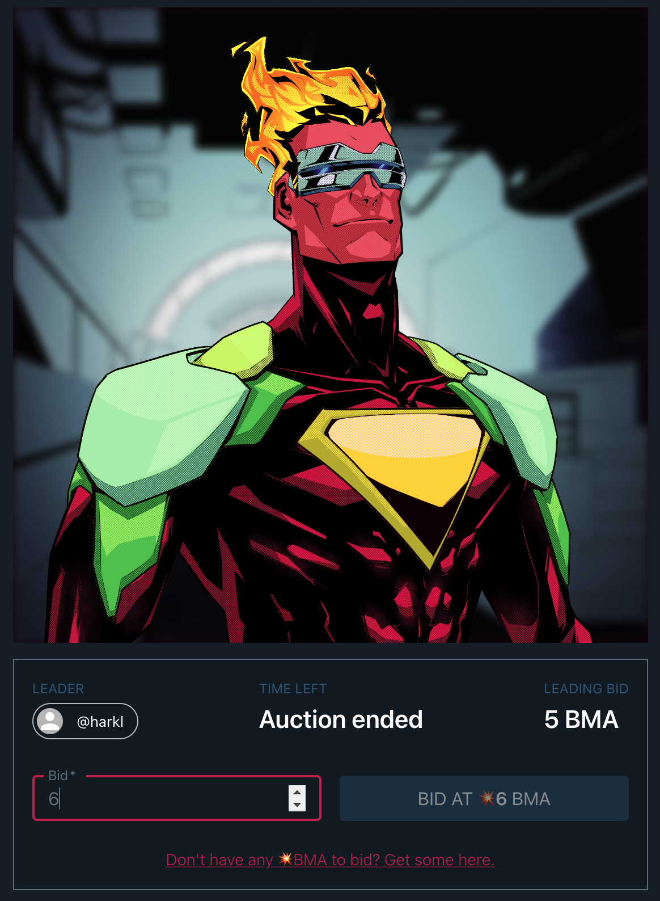
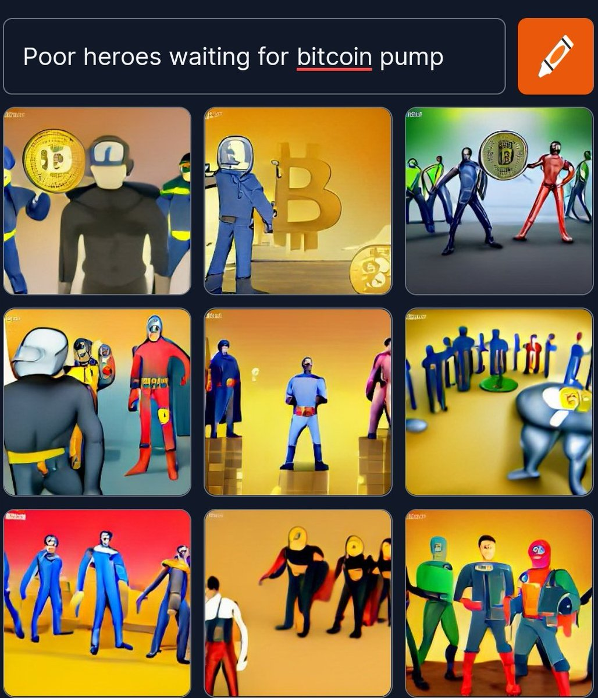
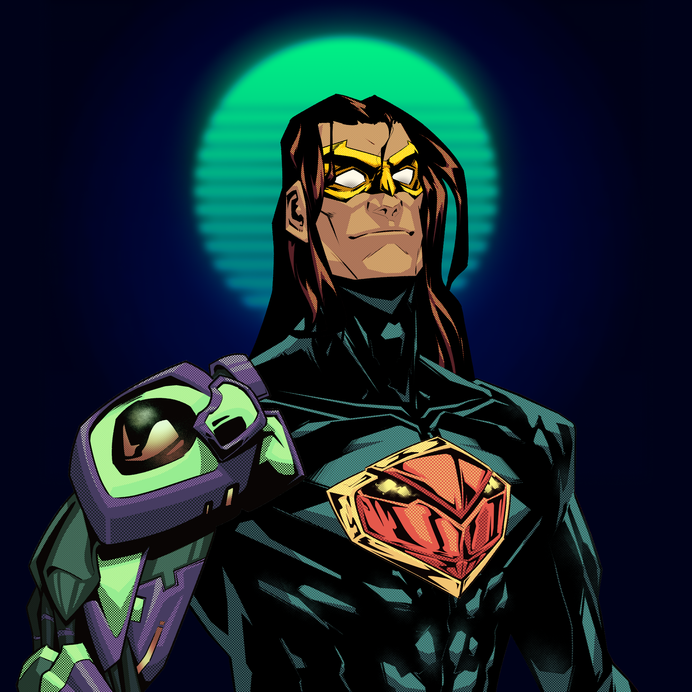
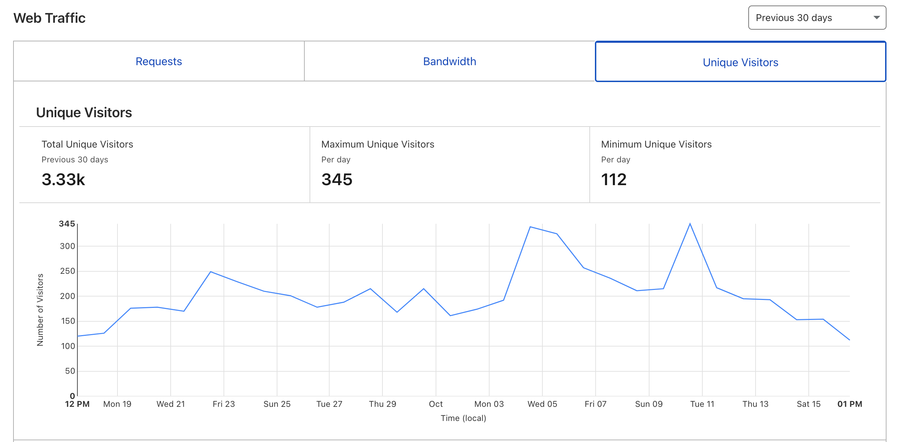
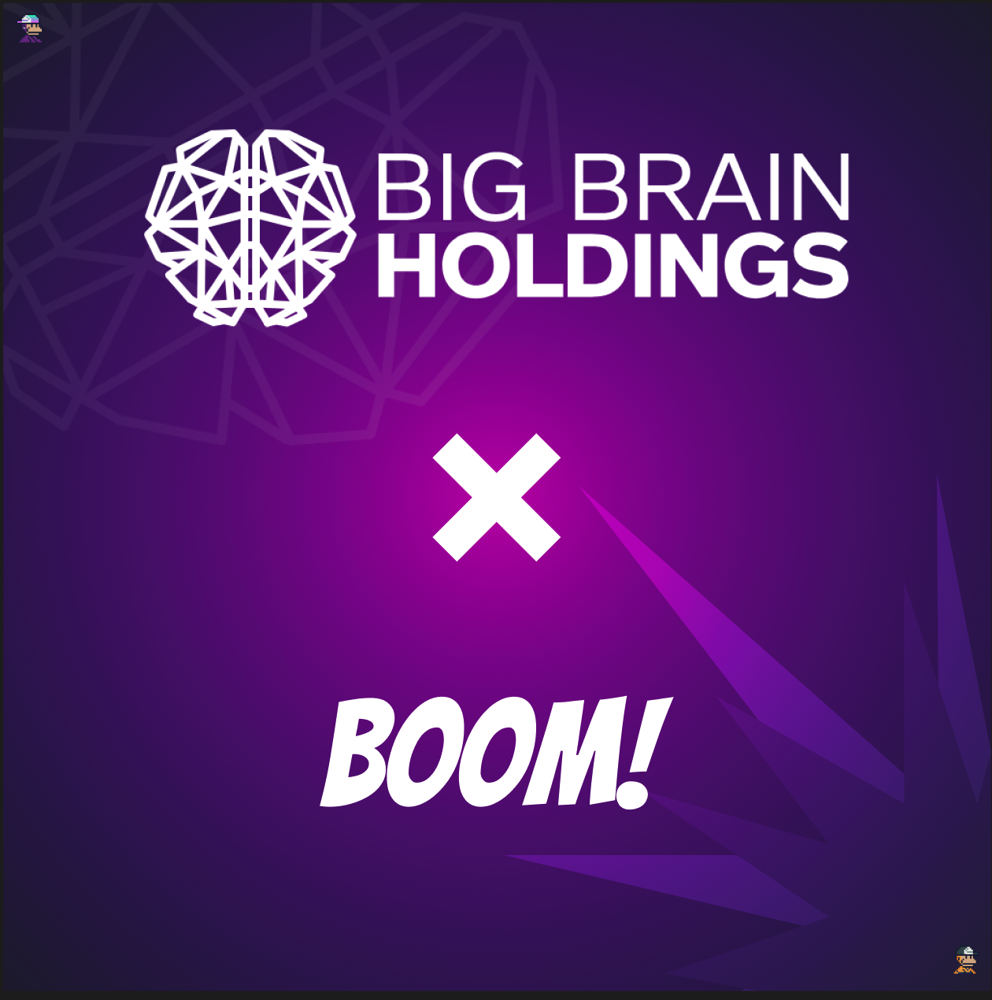

It feels like years since I last wrote a dev diary, but it's only been 10 weeks. The big news and reason for the quiet spot is our CEO Quiet-Salad/Dingo has stepped aside so I've been somewhat distracted while we completed the formalities associated with that.

I'd personally like to take the opportunity to thank Quiet-Salad for his involvement, hard work and dedication over the last year. We remain firm friends and although this is the close of one chapter, the book is long and who knows what the future holds.

The largely positive outcome of that event for the future is it has freed me up to take the project forward alone. I'm as passionate about Solana as ever and I've actually been finding the bear market an excellent environment to connect with like minded people as there's a lot less grifters around. I'm re-energized and ready to get on with the hard mahi of continuing the project and building our community with you all.

## The #BoomOnes Auction House

As of a couple of weeks ago I've started building out a new part of the site. A p2p auction protocol where a user will soon be able to create, list and sell an NFT directly from their social profile on Boom. It's getting very close to completion with delivery looking likely this week, and the community is really excited about it.

This is actually a huge deal for several reasons...

### I've built out the missing Open Source Auctioneer CLI for Metaplex

[Open Sourced Auctioneer CLI Github Repo](https://github.com/h4rkl/metaplex-auctioneer-cli)

[Metaplex](https://twitter.com/metaplex) do an amazing amount for composability and the Open Source elements on Solana. Giving back to one of my favourite projects on Solana gives me a huge sense of satisfaction. So I'm stoked to be able to build out the CLI and hopefully contribute to the first users on Solana using the program in production as the TX activity on mainnet hasn't registered any meaningful activity yet.

### Boom is moving toward permisonless P2P Auctions

It's been frustrating watching a lot of the big marketplaces on Solana become walled gardens in the fashion of web2. The whole promise of decentralization has been smashed to bits in the process where most marketplaces have long relatively complex application and approval processes. With people understandably being turned off by these sort of actions, the community has descended into bickering and infighting about royalties as profits have plunged. With zero royalties this has led to an avalanche of wash trading causing [Open Sea to suspend Solana NFTs out of their trending list](https://twitter.com/opensea/status/1581474813050179586). What a disaster driven by greed and degens.

A large part of the drive behind Profile based Auction Listings on Boom Army is to provide individuals an alternative to this mess. Boom is a platform where all you have to do to access everything is simply connect your Solana Wallet. We're building a freemium model where revenue rewards our people the more they contribute through tipping and engagement. And the auction house will be no different.

### #The1303 are finally going to get paid

For a good 6 months now I've been talking about [#The1303 NFT and profit sharing 13.03% of the marketplace proceeds](https://docs.boom.army/prologue/1303/) with the holders. With the advent of #BoomOnes this is finally happening and I can't state enough how stoked I am to finally deliver on this. ❤️

## The Poor Club X Boom Army

Boom have just finished part 1 of a 2 part colab with a with The Poor Club. We've swapped a [Boom Heroes NFT](https://magiceden.io/marketplace/boomheroes) and .poor domain NFT and completed a cross promotion to win the Boom Hero and 💥.poor NFT respectively. Part 2 will be to auction off a 💥📦 loot box on the new Boom Ones auction platform. This is a big deal because it's ironing out the framework for an easy template to do a bunch of colabs in the future. Most teams I've met are really short on time as a resource so being able to approach them with a one page outline to run an auction colab is a great opportunity for everyone.

### Winner of 💥.poor

Winner of 💥.poor [@Drowxes](https://twitter.com/Drowxes) with "Poor heroes waiting for bitcoin pump"

### Winner of Boom Heroes #2967

Winner of [Boom Heroes](https://magiceden.io/marketplace/boomheroes) #2967 was [@Frigaate](https://twitter.com/Frigaate)

## Metrics and Budgets

Metrics are still strong. We're consistently getting around 3k unique visitors per month with around 200k requests and our total connected wallets sit at just under 3.5k.

There are a few grant applications in the mix too. But no revenue currently. With the company split and settling debts owed I'm going to retain enough capital personally to keep the lights on for another 12 months or so. Any grants will make it significantly longer because the monthly costs currently sit around $400-600.

Unfortunately with the current state of budget and revenue I'm not going to make it to breakpoint any more though which I'm GUTTED about. There's always next year I guess ❤️

## Código Cyphex X Boom Army

Last week I was privileged enough to go on the Código Cyphex podcast. We spent half an hour chatting about the the last couple of months and what had been happening in the downtime. I love talking to @Drowxes who is honestly one of the best dudes I've met in the CT space since I've been involved.

<iframe width="560" height="315" src="https://www.youtube.com/embed/t6LE7mFll0E" title="YouTube video player" frameborder="0" allow="accelerometer; autoplay; clipboard-write; encrypted-media; gyroscope; picture-in-picture" allowfullscreen></iframe>

## Big Brain X Boom Army

At the start of the year Boom received a small amount of funding from Big Brain Holdings and it has paid for all the delivery since Feb:

* The Solana native social media experience (similar to twitter) on boom.army complete with follows, retweets, reactions, and notifications
* Instant social account creation simply by connecting your Solana wallet
* NFT secured chat for ANY NFT (similar to telegram) boom.army/d
* The ability for users to mint their own NFTs at boom.army/mint-nft
* On platform tipping of posts using the native $BMA token
* A profile gallery for user profiles to show off NFTs eg. [boom.army/harkl](https://boom.army/harkl)
* Our own NFT [Boom Heroes NFT](https://magiceden.io/marketplace/boomheroes) which allows access to post on the public social feed
* On-going hosting and storage fees

I honestly can't express enough how thankful I am toward them. None of what I've built would be possible without that funding.

Until we meet IRL - [harkl_](https://boom.army/harkl)
