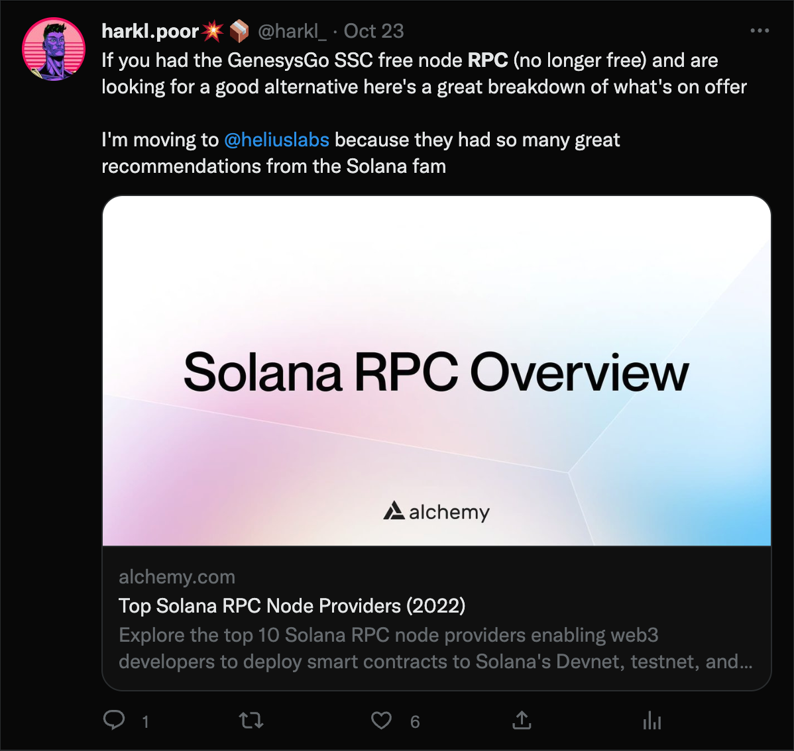

How to unpack a failed launch? Currently launching an auction house on Solana is very much still a case of chewing a bunch of glass. It's time to do a bit of an autopsy on the last weeks #BoomOnes Auction House launch and tell the story for future learnings and to preserve it for posterity. We're living through history folks.

## How did we get here?

Back in February, Boom launched an NFT called [The 1303 OG](https://docs.boom.army/prologue/1303/). It was delivered on the back of a registration form where 1303 Solana Wallets signed up to be the first testooors on [boom.army](https://boom.army), Solana's first Web3 Social Network. Part of the advertised perks for holding that NFT was to profit share revenue from Peer 2 Peer sales on the [Boom App platform](https://boom.army), as it was apparent there was an opportunity in the future to build a market place where people could permissionlessly buy and sell from each other. 

### The Metaplex Standard

Flash forward to May, when Metaplex released a [demo auctioneer program](https://github.com/metaplex-foundation/metaplex-program-library/tree/master/auctioneer) to run over the top of their Auction House program. This popped up on my radar in early August and I started looking at it as a serious contender to underpin the Boom Market Place and Auction House functionality.

The problem was, there was no Command Line Client for the Auctioneer program, so testing an end to end Metaplex Auction directly on-chain was problematic. But given how much Metaplex have contributed to the Solana Space (ie. they basically single handedly ushered in the NFT boom), I decided it would be mutually beneficial to build the client out myself and contribute some love to the ecosystem. Which is exactly what I did, and at the time of writing [the CLI is 90% complete](https://github.com/h4rkl/metaplex-auctioneer-cli).

## Enter the Monke DAO

During this build I noticed that Monke DAO were taking applications for grants to contribute to the proliferation of the Open Source ecosystem on Solana. So I applied for a grant citing the work I was doing on the Auctioneer CLI and reasoning that if they could fund it, I could spend a larger amount of time building not only the CLI, but an entire set of front-end components any junior dev could drop into any front-end and run their own permissionless market place just like Boom. The main motivation for a lot of this work is that for all it's talk of an open permisionless ecosystem, Solana has a bunch of gatekeepers in the space (eg. Magic Eden) who aren't interested in Open Sourcing their code base in spite of having used Open Source code to get going in the first place. It stinks to be perfectly honest because it's in direct opposition to the spirit of what blockchain is all about as an open transparent monetary system. So rather than just complain about it, I want to do something about it because I can.

Unfortunately the Monke DAO grant was unsuccessful, but I'm still committed to delivering the Boom Army part of the Open Source auction house. It's just it will be a lot less dev friendly in the docs department and won't be easily packaged up as a drop in solution. But now you understand the motivation and the Open Source bigger picture on what I'm trying to achieve.

## The Failed Build

As mentioned there's still a lot of glass chewing that needs to go on in the Auction space to get a working platform up and running. In the vacuum of an easily launched Metaplex Auctioneer program while I was still building the CLI I found [Candy Shop](https://twitter.com/CandyShopSpace) which looked like a good interim candidate to beta test the auction house UX, and was open enough for me to be able to implement a Solana program using their code base.

It took me about 2 weeks to pull together the front-end code and integrate the CandyShop API ready for release. The Candy Shop devnet interface wasn't working from the get go which should have been a red flag, but I pushed on with most of the testing on mainnet and it seemed to work well enough. That is until it came time to launch...

### RPC Malarky

Around this time GenesysGo turned off one of the most popular high volume RPC nodes in the Solana ecosystem. The debate about what they promised and intended on the back of the Shadowy Super Coders NFT sale is for another time, but as it turned out this would be a big deal in the release of the BoomOne Auctions as the GenesysGo RPC was hard coded into the Candy Shop SDK. This meant that on launch day I couldn't load any auctions, no one could bid, and the whole system was broken. So I had to not only find a new RPC, but also build something out that didn't have a baked in RPC implementation!

The hunt for a new RPC showcased how healthy the Solana ecosystem currently is. [There's a lot of good providers](https://www.alchemy.com/overviews/solana-rpc) out there as well as some amazing teams building top quality bare metal infra. But the lack of free infra doesn't bode well for democratizing the space. It's understandable because running a Solana node isn't cheap currently and with liquidity bleeding out of the entire financial system we're starting to see a few hobbyists turn off their nodes. I just hope that we don't end up with a class based system where power users get an unfair advantage because they can afford one. It's also another discussion for another time but to avoid that, my belief is we need on-chain advertising integrated into products ASAP with an opt out payment feature for people who can afford it.

The best discovery from the RPC hunt I made, is that [Monke DAO run an RPC validator](https://business.monkedao.io) complimentary for SMB holders which is just an amazing service tbh. But I'm also aware that I'm a privileged holder of an SMB and am lucky to access services like this as a result. So that's the RPC node Boom has running now and it's fast and has good request volume.

# Next steps

So where does that leave the BoomOnes Auction house? The next thing to do is to finish the Metaplex CLI which will mean I can run and test my Auction House program on devnet. From there I'll be integrating the program into the existing Boom App UX and we'll be launching again. I'm hoping this won't take much longer than a few days, and certainly not more than a week. But I'll keep everyone posted with updates on Boom, Twitter and Discord as per usual.

Until we meet IRL - [harkl_](https://boom.army/harkl)