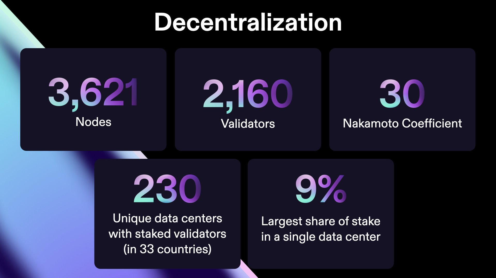
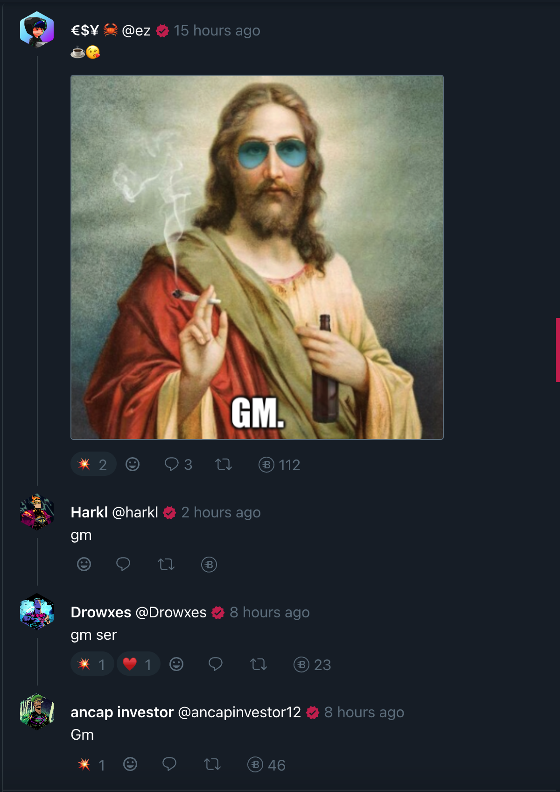
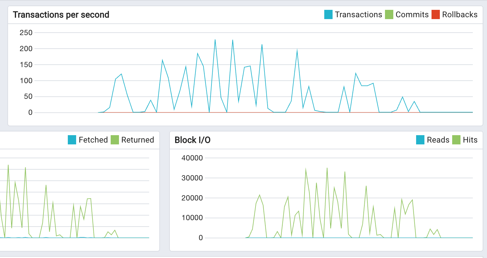

Time just absolutely flies in this space. Every time I'm back on the keys bashing out a blog post I can barely believe how much has happened in the last couple of weeks and how quickly it's gone.

## FUD in full force

Anyone who's been on CT and (Boom)[https://app.boom.army] will have seen discussion around the absolute shit storm of FUD that is currently being hurled around. The FTX collapse kicked it off, and every few days since then there seems to be a new issue for people to wring their hands over. The Metaplex token program keys, and who should control them; The Toy'R'Us FUD about depressed companies selling out; The Binance SNAFU with liquidity safety; Just to name the most high profile ones.

It can be exhausting to engage with all this FUD, and as a result we've seen a lot of people leave the space. But over the same time frame we've started to see the remaining community whittle down to the absolute best of the best. I'm super bullish on the remaining people and projects. WAGMI seems a little outdated as a phrase now, but the sentiment still remains. It feels like we need a new catchphrase forged in the depths of the Bear!

There's a great excerpt in The Bible that talks about what success looks like in hard times like this, and although the passage relates directly to eternity and being with God who is the ultimate prize, it's good encouragement for crypto also:

"So we’re not giving up. How could we! Even though on the outside it often looks like things are falling apart on us, on the inside, where God is making new life, not a day goes by without his unfolding grace. These hard times are small potatoes compared to the coming good times, the lavish celebration prepared for us. There’s far more here than meets the eye. The things we see now are here today, gone tomorrow. But the things we can’t see now will last forever."

(2 Cor 4)[https://www.biblegateway.com/passage/?search=2%20Corinthians%204%3A17-18&version=MSG]

My experience of God leading me through "hard times" and being right beside me through-out has prepared me well for the Bear. Every day I feel his grace and provision - it's a familiar pattern, and I know that he's blessing everything I'm involved with. Even though it may not turn out as I expect, it's always much better than I can imagine.

### TLDR;

IMHO all of this is necessary and important on the path to anti-fragility for a truly decentralized Solana blockchain. It's hard to see it now, but long term it's going to be a net positive.

## Delivery diary

There's been a tonne of delivery over the last couple of weeks on (Boom)[https://app.boom.army], with some big changes to the app including:

- Quicknode RPC implemented
- Threaded comments UX upgraded
- Verified profiles using (BoomHeroes)[https://www.tensor.trade/trade/boomheroes]
- Improved profile metadata
- NFT profile PFP improvements
- Fetch for 'n' new meeps
- Material UI upgraded
- Feed returned to everyone can post

## DB instance flying

The lift and shift of the database to anonymously hosted, Bitcoin paid servers that was completed last month has been a HUGE success. We're not constrained by the Amazon RDS "premium" features like IOPS and disk speed any more, and have been seeing some really good metrics coming though on the monitor. It's a big step forward and is going to ensure stability and scale, with leaner costs up until about 500k users.

Until we meet IRL - [harkl](https://app.boom.army/harkl)