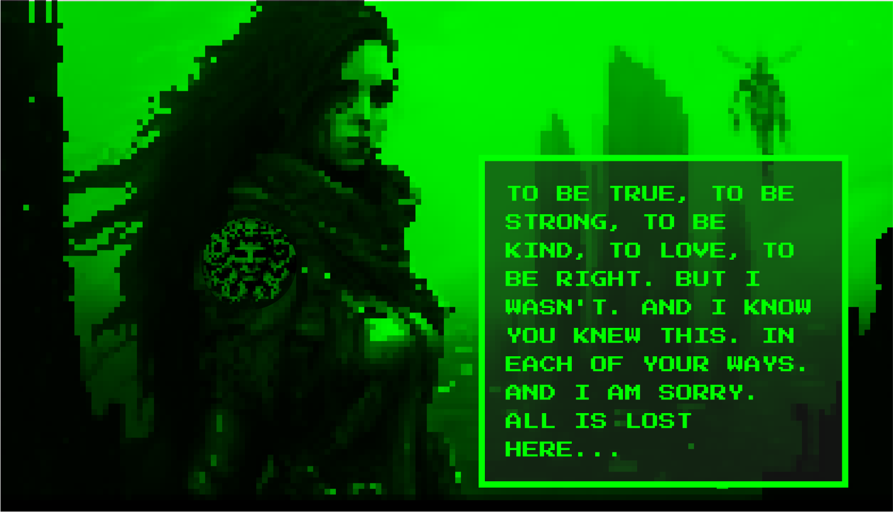
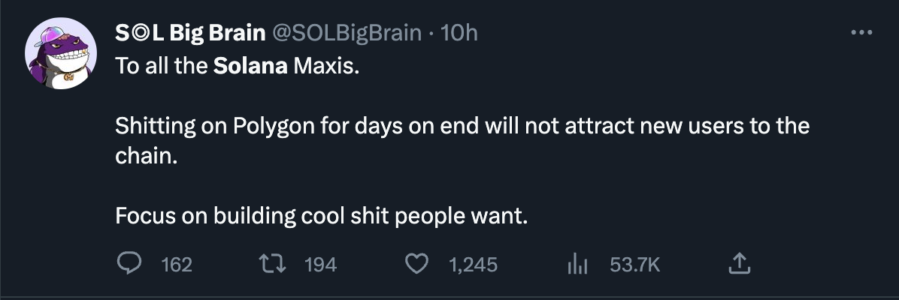

Over the past two weeks, I've been working tirelessly to rebuild large parts of [Boom](https://app.boom.army), a blockchain-based social media app. With significant improvements to the platform and an upcoming on-chain AI-based dungeon crawl called WhatIsGorgon, there's a lot to be excited about. Let's dive into the details.

## The Boom post format has been rebuilt

The post format on Boom has undergone a major revamp, enhancing both the user experience and the overall aesthetic of the platform. With a cleaner layout, improved typography, and better support for various media types, the new post format ensures a seamless browsing experience for users.

## The main Boom meep feed has been rebuilt

The primary meep feed on Boom has also been rebuilt from the ground up. This revamped feed is now faster, more responsive, and better optimized for various devices. Users can expect a more engaging and enjoyable experience as they scroll through the latest meeps on the platform.

## WhatIsGorgon is going to be an on-chain AI-based dungeon crawl

I'm also excited to announce the development of WhatIsGorgon, an on-chain AI-based dungeon crawl. This project aims to bring an immersive text based social gaming experience to the Solana blockchain, combining the thrill of dungeon exploration with the power of artificial intelligence. Stay tuned for more information on [#WhatIsGorgon](https://twitter.com/search?q=%23WhatIsGorgon&src=typed_query&f=top) and its upcoming release.

## I need some suggestion for what we should display on the dashboard

As part of the ongoing improvements to the Boom platform, I'm seeking suggestions for what to display on the dashboard. If you have ideas for valuable insights or features that would enhance the user experience, please feel free to share them in the comments below or reach out to me directly.

## Tweet of the week

## Conclusion

The recent improvements to the Boom platform and the upcoming release of WhatIsGorgon are just the beginning of the exciting developments within the Solana ecosystem. Keep an eye on this space for more updates and future announcements.

Until we meet IRL - [harkl](https://app.boom.army/harkl)
