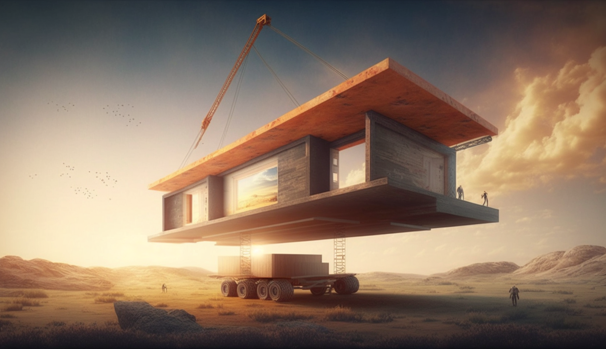
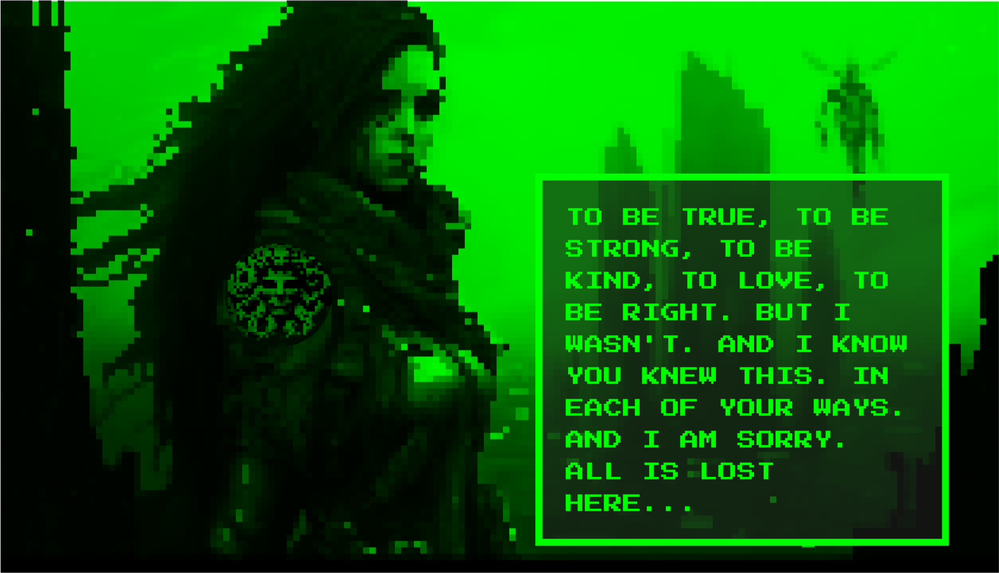

# Platform Upgrades for Boom in Preparation for WhatIsGorgon and Sub-DAOs

Hello everyone! I'm excited to share some recent updates to our project that I've been working diligently on. We've made significant changes to prepare the backend and client for new code, involving library upgrades and adopting modern best practice approaches.

- **Codebase Improvements:** Huge chunks of the codebase have been upgraded to do with NFTs and Solana on-chain interactions making the whole app up to date and ready for the next round of dev.
- **Tipping Functionality:** We improved the tipping process by updating the instructions and aligning them with the latest best practices for secure transactions.
- **NFT Gallery and Minting Enhancements:** We focused on streamlining the NFT gallery and minting process for users. This included adding a link in the successful mint message, upgrading the minting modal, and making design updates to match our platform's aesthetic.
- **(Metaplex)[https://www.metaplex.com] and UMI Context Integration:** We added the latest (Metaplex)[https://www.metaplex.com] context, allowing us to use (Metaplex)[https://www.metaplex.com] tools and updated connection and wallet adapters. We also incorporated UMI context and updated the build configuration for easy consumption across the client.
- **Incremental Changes:** We made smaller adjustments, such as adding breaks for the showMessage function and fixing box width for feeds, to further improve the user experience.

I'm working hard to enhance the platform so that when the next bull market arrives, we'll be well-positioned to seize any opportunities that arise.

## Update on #Boom30K Celebration

There's no timeline on the (#Boom30K)[https://boom.army/explore?type=TAGS&term=%23Boom30K] wallet celebration. I'm interested to hear feedback about how we might run this. Having an online event where we all jump in a Twitter space could be fun and then run an online wheel of fortune ticker. Let me know if this appeals.

## Boom Auction House Progress

All this (Metaplex)[https://www.metaplex.com] NFT work folds directly into the Auction House delivery. Having the right toolset for minting, auctioning, and custodianship of NFTs is essential for the functionality.

## Boom Sub-DAOs

The sub-DAO functionality is the next priority now that the (Metaplex)[https://www.metaplex.com] upgrades are completed. This should be a relatively small piece of work, so expect to see it delivered soon.

## WhatIsGorgon

(#WhatIsGorgon)[https://boom.army/explore?type=TAGS&term=%23whatisgorgon] is a fundamental play to showcasing how apps on Solana can integrate with Boom and use (sub-DAOs)[https://boom.army/d] to socialize their apps. For that reason, this is a bit more of a long-term project. For the next few months, I'll be sharing more information about what this looks like and aiming to put together a comprehensive info pack to attract investment for building it with a team. This will mean much faster delivery and overall competitiveness. It's easy to forget that I'm one (albeit experienced) person delivering one of the most ambitious projects in the Solana space. But this is backpack embedded app level big in terms of functionality and delivery.

## Calling All Investors

If you're an investor currently seeking an established Solana project with significant upside potential to lead a round on, please feel free to get in touch.

Until we meet IRL - [harkl](https://boom.army/harkl)