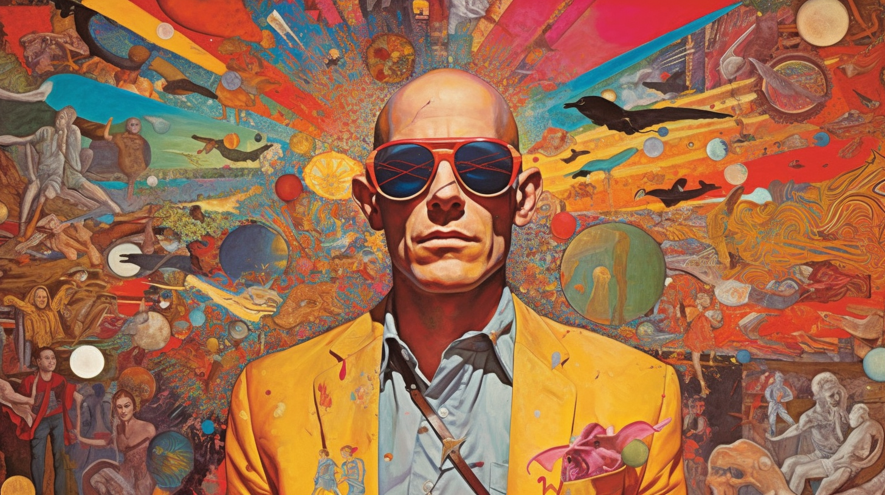

# A Savage Journey into the Heart of the Code Jungle: The Chronicles of a Renegade Developer

Hello, you savage beasts of the [Boom](https://boom.army) wilderness!

In the last moon cycle, I've been marinating in the midnight oil, wrestling our unruly software beast into something that you, yes, you, my fellow tribesmen and women, can proudly stake your flag on. I'm here to pull back the curtain on this madness, give you a glimpse into the bedlam that is my existence as I meticulously chisel, mold, and perfect this digital monolith we're all tethered to which will be ready for your delictable consumption in a few short parsecs.

## Hieroglyphs, Symbols and the Aesthetics of Insanity

Brace yourselves for a psychedelic whirlwind of visual alteration on our platform's landscape. I've gone under the hood, tinkering and toying with the hue of the emojipicker icon and the tipping icon button like a mad scientist mixing volatile chemicals. I've summoned the dicebear icons into our midst for default avatars. The devil is in the details, and this devil is ready to unleash these tweaks upon your unsuspecting browsers.

## The Labyrinthine Madness of Navigation and Interface

An enormous chunk of my waking hours has been spent weaving through the labyrinth of our software's navigation and interface, a Theseus in the maze of Minotaur. I've hammered out a new navigation architecture, implanting Hero tiles and submenu items into the digital beast, wrenching the mobile bottom nav into its own component, and yanked the MiniDrawer component into its private domicile.



And then I took a hacksaw to the left-hand navigation drawer elements and lavished some final spit polish on our floating navbar. When this beast of changes roars into life, you should glide through our labyrinth like a greased eel.

## Tectonic Shifts in Layout

I've been eyeballs deep in a seismic wave of layout adjustments. I've wrestled the menu box to the left within the main routes grid content, coerced the Master Grid container to play nice with a left-aligned menu. This machination of change should oil up the visual flow, making it as smooth as an acid trip.

## Decoding the Matrix: Theming and Styling

The whirlwind of changes to theming and styling would give a lesser coder vertigo, but fear not, I've navigated the storm, all for your digital comfort. I've rewritten the holy scripts of all Typography elements to pass the tsc color trials, thrown a global styles cape over the theme, and jazzed up the paper background for both light and dark motifs.

And hold onto your hats, folks, I've torn out the Material UI theming modules by their roots, paving the way for the mysterious CSS NFTs. I've also cracked the code on the theme picker, allowing you to customize the beast's appearance to your heart's content.

## The Long, Strange Trip Ain't Over Yet

Each of these digital mutations might seem like mere ripples in the pond, but together, they form a tsunami of transformation in the user experience. It's been a love affair, and I can hardly wait to fling these updates your way. But don't for a moment think this is the last stop - I'm already gearing up for the next wave of tweaks, refinements, and improvements in my relentless quest to craft the best digital beast money can't buy.



As ever, I'm all ears for your rants, raves, and suggestions. Thanks for saddling up for this rollercoaster ride. I'm stoked to keep this party rolling with you, for you.

Keep your eyes on the horizon for more updates. Until then, keep the faith!

- **Lines added:** 7078
- **Lines removed:** 3594

Until we meet IRL - [harkl](https://boom.army/harkl)
