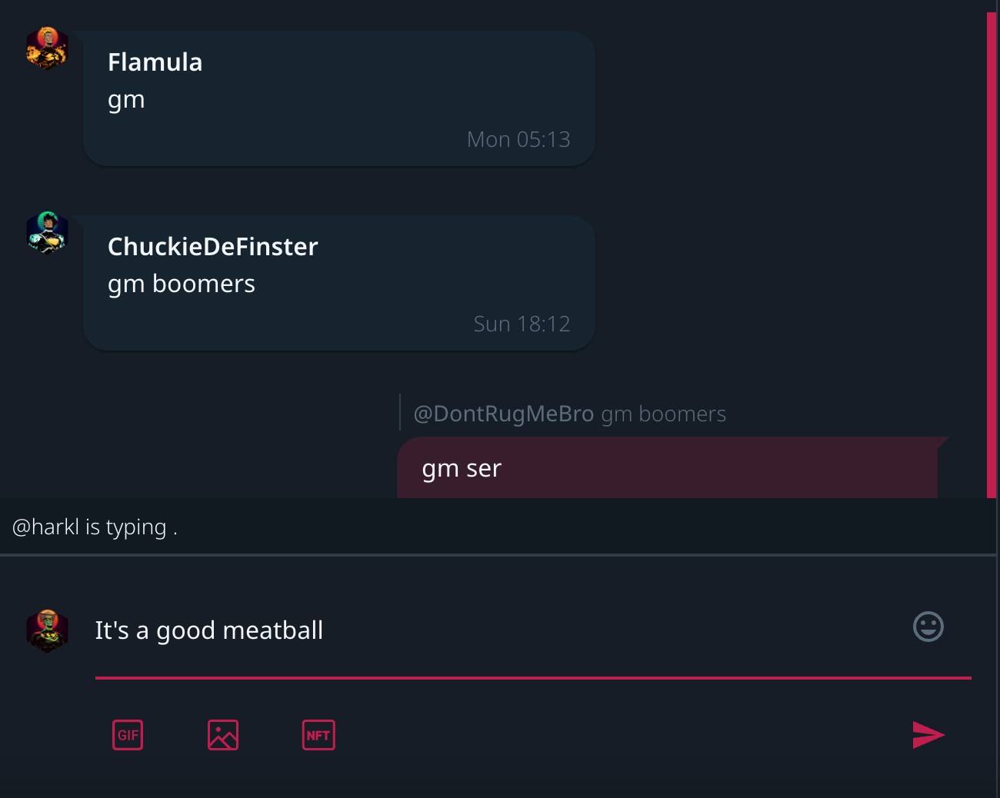

So there I was, waiting to commune with the universe. I was about to unleash a series of updates to shake up the Solana DAO space, which will hit the streets like a thunderclap. Get ready to get a whole lot of Juju all in one place, because we're in for one wild ride.

## Riding the DAO Messaging Wave

Slap your own face and say Rammalammadingdong, because DAO messaging is about to be released. Gone are the days of twiddling your thumbs on Twitter messaging, switching between windows like a crazy person. Now, the key pounding can all happen right in native Boom DAO chat and you'll see right on screen who is typing as they smash their fist mandibles into the tappy tappy interface.

The real action happens under the hood. We've laid down the tracks for web sockets and setup GraphQL subscriptions that'll get all queue based interaction event updates to your screen faster than a hot scoop hits the newswire. We've gone all in with Redis for subscriptions, tracking everything from the 'typing' status in specific channels to sequential news feed updates like a hawk on a mouse.

That's not all. We've jacked up the API and database to handle User and Channel relations like a $2 hooker - hot and heavy - and I can't wait to see how you'll ride the wave as we transition to our new chat home.

And for the grand finale? We've decked out all messaging UX within DAO channels with a design UX that's smoother than a silk suit. Think telegram and whatsapp because you're in for a hell of a native DAO chat session, all secured by your most expensive and ridiculous NFTs.

## Dev Infrastructure - The Revamp Revolution

And then came the Dev Infrastructure revolution, shaking up the old guard and ushering in a new era. We kicked the moment library to the curb and invited day.js to the party, setting the stage for better dates with a lighter codebase footprint.

We've morphed fetch channel data into a universal react hook, like an omnipotent channel god. Sticking with the spirit of change, we've tossed out epochs like yesterday's newspaper, opting for human-readable isoStrings. From now on for the devs, it's clear sailing when it comes to dates.

We took the old routes handler out back, and what came back was a whole new beast, armed with outlets for all routes that can now use universal Grid templates. You won't notice a visible change but for delivery bringing different view templates is now going to be as easy as a Sunday morning.

To cap it all off, we've revamped all MUI Paper components to use native elevation, ditching custom styling like a bad habit. There were some code decisions around how MUI worked that needed to be put to bed like a grumpy child, so they could wake up in the morning with a fresh perspective on life.

## Round it up

That's the long and short of it, folks. Another tsunami of updates is set to roll out shortly, and I'm as excited as a Leprachaun at the end of a rainbow to see how it'll shake things up and effect everything from #BoomHeroes to $BMA. And remember, your two cents are worth a million bucks to me, so don't be shy about letting me know what you think when the storm hits.

## The week in code stats

### Front end

- **Files changed:** 132
- **Lines added:** 755
- **Lines removed:** 9002

### Back end

- **Files changed:** 91
- **Lines added:** 616
- **Lines removed:** 405

Until we meet IRL - [harkl](https://boom.army/harkl)
