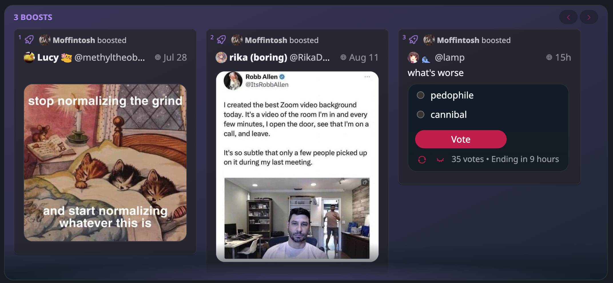

I'm thrilled to share with you all the updates we've made in the latest release of our software. I've been working tirelessly to bring you a smoother, more polished experience, and I'm excited to walk you through the new features and improvements.

## Design Improvements

We've made some significant improvements to the look and feel of our app. One of the first things you'll notice is the enhanced copy for interactions on replies. This change makes it easier for users to understand the context of each interaction, improving the overall user experience.

We've also made several design tweaks, such as:

- Preventing the hero container from expanding too tall, which makes the UI more consistent.
- Fixing the radius, which was causing some visual inconsistencies.
- Restyling the play icon to make it more visually appealing.
- Updating the link style on status cards for a more cohesive look.
- Stretching the content for boosts in the boosts carousel, providing a more seamless experience.
- Showing the vote count in translated text, making it easier for users to understand the popularity of a post.
- And many more!

## Bug Fixes and Optimizations

In this release, we've squashed some pesky bugs that were affecting the user experience. One of the most noticeable fixes is the Flash of Loader (FOL) issue, which caused a brief flash of the loading screen when the app was launched. We're happy to report that this issue has been resolved.

We've also addressed some rendering bugs that were affecting the Preact version of our app. After testing, we found that the bugs seemed to be fixed in Preact v10.17.1. However, we had to temporarily downgrade Preact to v10.16.0 due to some rendering issues with v10.17.0. Don't worry, we'll keep an eye on future updates to ensure we're using the most stable version.

## Features and Enhancements

We're excited to introduce the experimental Shortcuts settings import/export feature! This new addition allows you to easily transfer your custom shortcut settings between different devices, making it more convenient to set up your preferred workflow on multiple devices.

We've also added a fancy screenshot to the documentation, giving you a visual reference for some of the features we've been talking about. We hope this makes it easier for you to understand how to use the software effectively.

## Behind the Scenes

I've also made some under-the-hood changes that may not be immediately visible but contribute to a smoother experience. These include:

- Upgrading dependencies to ensure we're using the most recent and stable versions of our tools.
- Further polishing the hashtag stuffing logic to improve the way hashtags are displayed.
- Checking for cases where there are no shortcuts to prevent potential errors.
- Updating the copy for import/export to make it clearer and more user-friendly.
- Documenting the hashtag stuffing collapsing implementation to provide better clarity for developers.

## Safari Fixes

For our Safari users, we've made some specific fixes that should improve your experience. We've addressed an issue with the media modal next/prev buttons not working in Safari. After a few attempts, we managed to resolve the issue. Additionally, we've spruced up the buttons in the media modal to make them more visually appealing.

## Final Thoughts

I'm really happy with where Boom has got to at this stage of the cycle. There's improvements being shipped every week, there's a road map for integrating Solana with the socials, and everything is sustainable meaning that I can run this whole thing positioning it for the right opportunity to launch it into the stratosphere if the right season presents itself.

## The week in code stats

- **Files changed:** 70
- **Lines added:** 928
- **Lines removed:** 533

Until we meet IRL - [harkl](https://boom.army/#/social.boom.army/a/110693550018915728)
