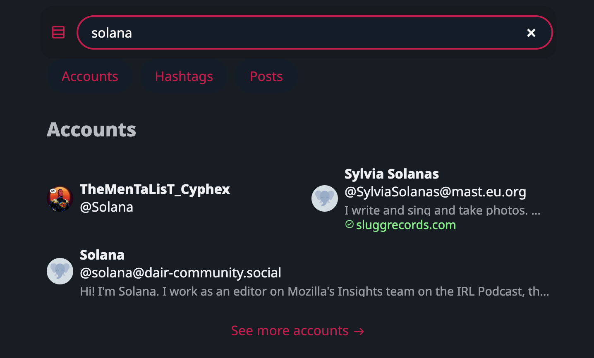

Hello friends,

I'm excited to share with you the latest updates [Boom](https://boom.army) has rolled out. As usual I've been working way too many hours across multiple proijects, but I'm thrilled with the progress we've made.

## Enhancements and Fixes

We've made some significant improvements to the search command. It now disappears as expected, making your user experience smoother. We've also fixed a bug with hashtags opening account sheets, and another one related to submenus. 

I've also been experimenting with the UI. You might notice a new style for our 2nd-pass grouped notifications and avatars. We've also made some tweaks to the poll items translation, removing the "votes" text for a cleaner look.

## New Features

I'm particularly excited about the new compose button. You can now open the composer with 'c', and 'shift+c' opens it in a new window. This should make drafting your thoughts even easier.

We've also added support for new languages. This is a big step towards making our community more inclusive and diverse.

## Push Notifications

Yes, you heard it right! We've introduced push notifications (still in beta). This should help you stay updated with the latest happenings.

## Other Updates

We've made some changes to improve the overall user experience. For instance, we've enabled relative path hosting and made some adjustments to the initial states after logging into a new account.

## Looking Ahead

As always, your feedback is invaluable to us. We're constantly working on improving and expanding our features. 

In the pipeline, we have some exciting developments:

- **Linking to Enafore and Tusked:** Enafore and Tusked are two platforms that we believe will greatly complement the functionality of Boom. Enafore is a cutting-edge project management tool that helps teams collaborate more effectively. By linking Boom with Enafore, we aim to streamline your workflow and make it easier for you to manage your projects. On the other hand, Tusked is a popular social networking platform known for its user-friendly interface and robust features. By integrating Tusked with Boom, we hope to enhance your social networking experience and make it more seamless.

- **Bidi Fixes:** Bidi, short for bidirectional, is a term used in the field of web development to refer to the support for languages that are read from right to left, like Arabic and Hebrew. We've noticed some issues with our current bidi support, and we're working on fixes to ensure that Boom is fully accessible and user-friendly for speakers of right-to-left languages. This is part of our ongoing commitment to making Boom a truly global and inclusive platform.

Stay tuned for these exciting updates, and as always, we welcome your feedback and suggestions!

## The week in code stats

- **Files changed:** 146
- **Lines added:** 3386
- **Lines removed:** 1499

Until we meet IRL - [harkl](https://boom.army/#/social.boom.army/a/110693550018915728)