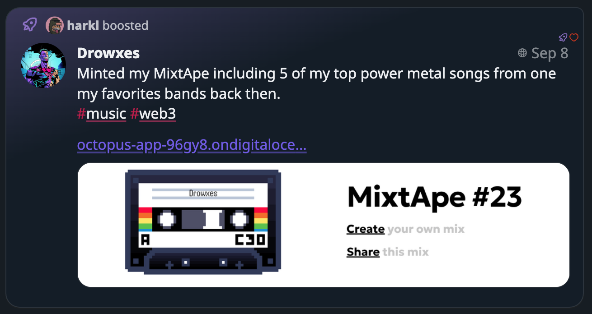

Full steam ahead!

## Enhancements and Bug Fixes

We've made several enhancements to our platform. We've upgraded our dependencies, made some style changes to the home header, and fixed a bug with the document title not working properly. We've also experimented with a new UI, made some quick fixes for small screens, and improved the positioning of the text expander.

## New Features

We've introduced some new features that I believe you'll find useful. We've added an account statuses timeline and made a few aesthetic changes to the Account sheet. We've also added a feature that allows you to see a post in the currently logged-in instance.

## Code Refactoring and Cleanup

In our continuous effort to improve our codebase, we've done some refactoring work, removed old unused code, and fixed some bugs. We've also started work on an account-specific store and upgraded our dependencies.

## User Experience Improvements

We've made several improvements to enhance your user experience. We've adjusted the header margins, added a custom titleComponent for the Timeline, and handled hashtag links quietly. We've also made some changes to the color hues for a better visual experience.

## Privacy Updates

In line with our commitment to user privacy, we've added a privacy.md file and provided links to our privacy policy.

## The week in code stats

- **Files changed:** 53
- **Lines added:** 724
- **Lines removed:** 379

Until we meet IRL - [harkl](https://boom.army/#/social.boom.army/a/110693550018915728)