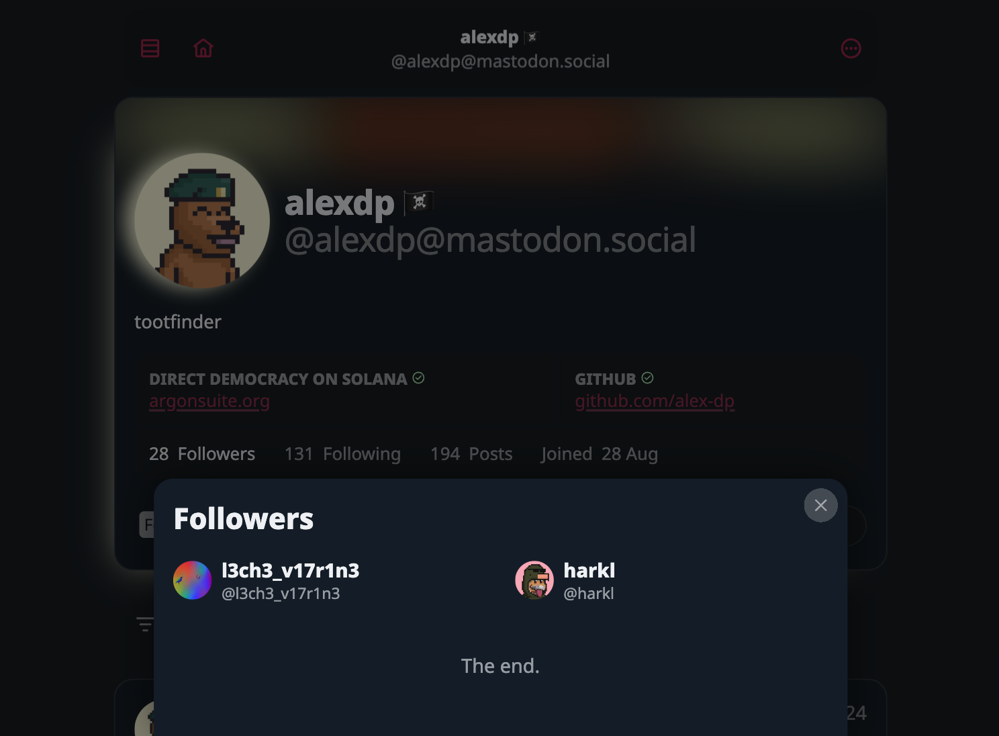

Hello friends,

I'm excited to share with you the latest updates we've been working on. It's been a busy period, but we've made some significant strides.

## Enhancing User Experience

We've made several tweaks to improve your experience. We've fixed the issue with the 'Read More' button being wrongly positioned on Safari, and made it look more consistent across the platform. We've also added a subtle text shadowing and restyled the shiny pill for a sleeker look. 

## Emojis and Translations

We've added support for non-rectangular custom emojis 😩. Isn't that cool? We've also made some updates to our Privacy Policy to include Post Translations. Now, we have multiple translation instances as fallbacks with retries to ensure nothing gets lost in translation.

## Interface Improvements

We've made several changes to make the interface more user-friendly. We've allowed RTL for text inside cards and made the status card larger inside large status. We've also beautified the play icon a bit and added more aesthetic touches to the 'Read More' buttons.

## Debugging and Fixes

We've been hard at work squashing bugs and making improvements. We've fixed Lemmy post links and the issue with the push notification badge showing a white box on Android. We've also handled moved account cases and made several other fixes.

## Posting Stats and Other Features

We've added an experimental posting stats feature for non-following accounts. We've also added a tooltip to show percentage values of posting stats and small gaps between bars for better visibility. 

## Wrapping Up

We're constantly working to make our platform better and more user-friendly. Your feedback is invaluable to us, so keep it coming. Thank you for being a part of our journey.

## The delivery in code stats

- **Files changed:** 123
- **Lines added:** 1417
- **Lines removed:** 811

Until we meet IRL - [harkl](https://boom.army/#/social.boom.army/a/110693550018915728)