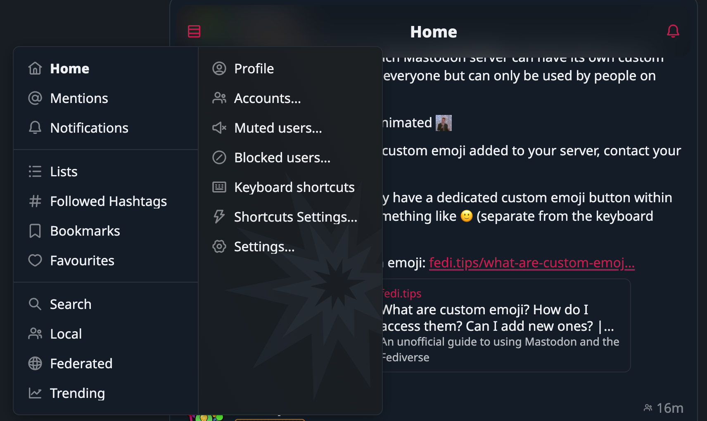

Hello friends,

I'm excited to walk you through this weeks updates.

## User Experience Enhancements

We've made some significant changes to improve your experience. Icons for muted and blocked users have been updated for better visibility. We've also added a synced icon and a link to the instance for more settings. 

To avoid confusion, we've fixed the issue of duplicate alt badges and removed the 'Media {i}:' text. We've also added more conditions for showing and hiding captions, making the interface more intuitive.

## Listing Muted/Blocked Users

In our quest to give you more control, we've implemented a minimum viable product (MVP) for listing muted and blocked users. Now, you can easily see the roles in account info. 

## Media Handling

We've made some exciting changes to how media is handled. We've experimented with figcaptions for multiple media and placed captions to the right side of media when there's enough space. We've also allowed GIFs to play on focus/blur and passed the language into media description for better accessibility.

## Code Clean-up and Upgrades

In the background, we've been tidying up the code and upgrading our tools. We've removed unused imports, upgraded preact, and fixed warnings. We've also removed some previous experimental code that was no longer needed.

## Language and Translation

We've made some improvements to language handling. We now show a Translate button when a different language inside the alt modal. We've also fixed a bug where the name text became too easily clickable.

## Aesthetics and Accessibility

We've replaced the Info icon with an ALT badge, faded out yellow more, and used luminosity for aesthetics. We've also made it possible to show more figcaption and allowed filters for posts in carousels.

## The delivery in code stats

- **Files changed:** 89
- **Lines added:** 1301
- **Lines removed:** 821

Until we meet IRL - [harkl](https://boom.army/#/social.boom.army/a/110693550018915728)