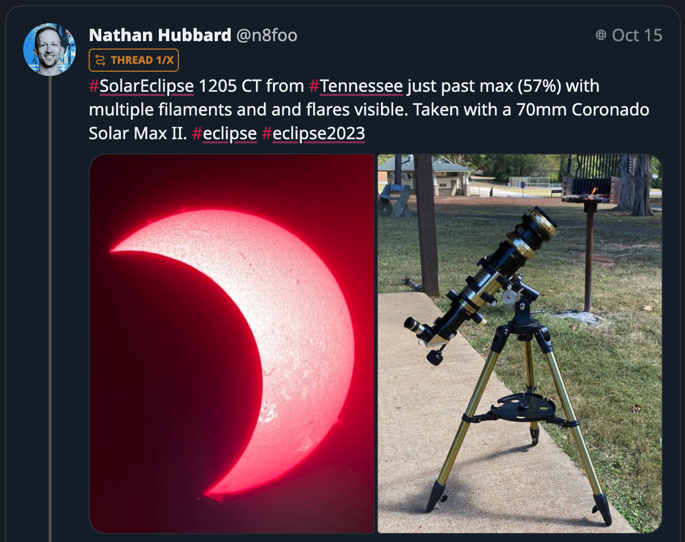

Hello friends,

I'm excited to walk you through this weeks updates.

## Enhancements and Fixes

We've made several enhancements and fixes to improve your experience. We've fixed an issue where captions were getting squashed. We've also made some adjustments to ensure that time links don't overlap too much, and we've bumped the contrast slightly for shiny pills to make them more visible.

## Upgrades and Adjustments

We've upgraded preact/preset-vite and made some slight adjustments to the notification system, allowing them to close early. We've also made sure to set content warnings only when there's spoiler text.

## Improvements to Content and Images

We've made some significant improvements to the way we handle content and images. We've grouped similar captions together, and we've made it so that related captions are highlighted when you hover over an image. We've also fixed an issue where images were breaking when restoring from a draft.

## Performance and Optimization

We've made some changes to improve performance and optimize our processes. We've replaced `scrollIntoViewIfNeeded` with `scrollIntoView`, and we've moved some processes up as the Intl stuff seemed to run slow sometimes. We've also made some changes to better throttle instead of debounce.

## Visual Adjustments

We've made some visual adjustments to improve readability and aesthetics. We've improved the contrast for visited links in dark mode, and we've made figcaptions self-align to the bottom. We've also made slight adjustments to the carousel top buttons.

## Cleanup and Final Touches

Finally, we've done some cleanup and added a link to Mingcute icons. We've also made our use of `dir=auto` more robust.

## The delivery in code stats

- **Files changed:** 129
- **Lines added:** 2130
- **Lines removed:** 2031

Until we meet IRL - [harkl](https://boom.army/#/social.boom.army/a/110693550018915728)