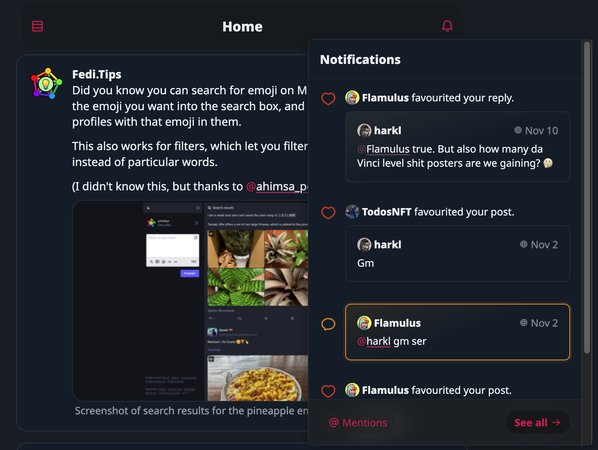
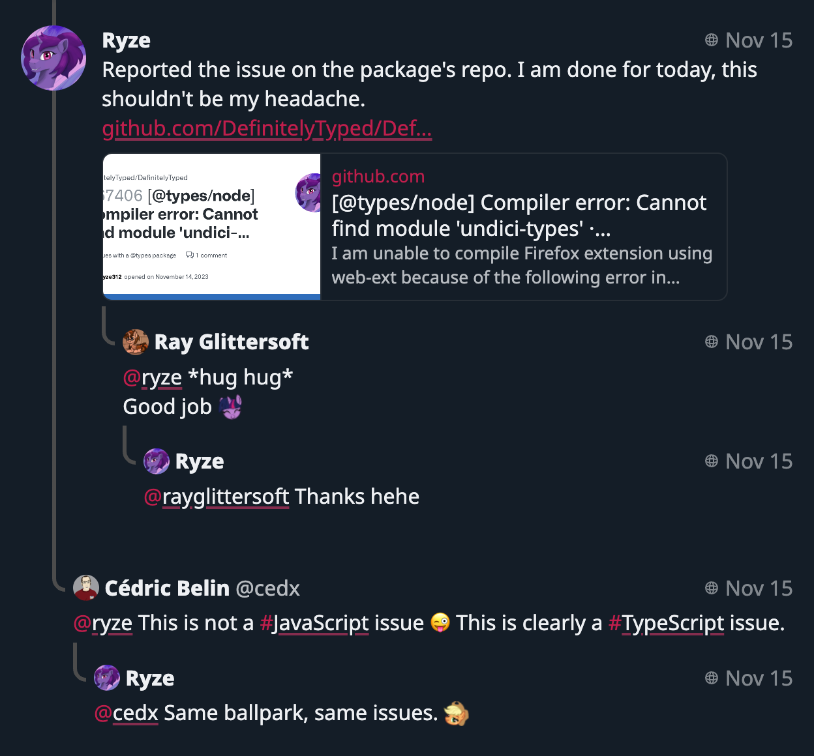
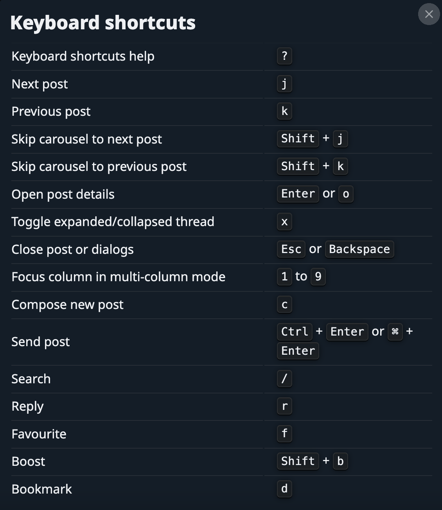

Hello friends,

I'm excited to share with you the latest updates I've been working on. I've been a busy bee, and I'm thrilled to share the fruits of my labor with you.

## Enhancements and Fixes

I've made several enhancements to improve your experience. I've enabled comment hints for the end of [threads or conversations](https://boom.army/#/social.boom.army/s/111410013223751297), making it easier for you to follow discussions. I've also made some adjustments to the compose field and upgraded our dependencies to ensure everything runs smoothly.

I've fixed a few bugs too. I've addressed issues with pinned posts not showing pins, fixed promise errors with fetching followed hashtags, and resolved a rendering bug when switching media filters.

## New Features

I've introduced some new features that I hope you'll love. I've added new keyboard shortcuts to make navigation easier. I've also added more unfurling to give you more context for links shared in posts.

I've also made some improvements to the Welcome page layout and added a feature to prevent [GC posts from notifications](https://boom.army/#/mentions). I've also reduced the interval to 15s to make the app more responsive.

## Performance Improvements

I've made several performance improvements to make the app run smoother. I've slowed down polling if you've scrolled down, reducing the load on your device. I've also added some sort of "garbage collection" to clean up unused data and prevent the extra call if posts = 0.

## Final Words

I've been working hard to make our app better for you. I've made many other improvements and fixes that I haven't mentioned here. I hope you enjoy these updates as much as I've enjoyed working on them. As always, I'm grateful for your support and feedback.

Until next time, happy coding!

## The delivery in code stats

- **Files changed:** 410
- **Lines added:** 5614
- **Lines removed:** 2631

Until we meet IRL - [harkl](https://boom.army/#/social.boom.army/a/110693550018915728)