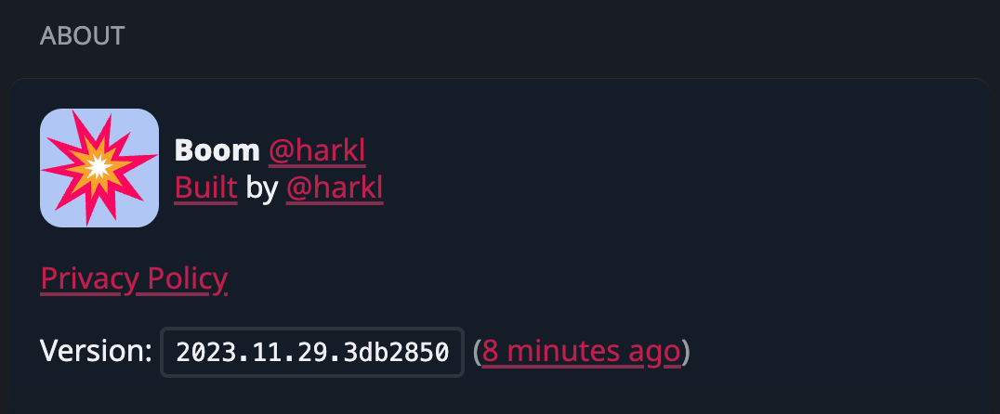
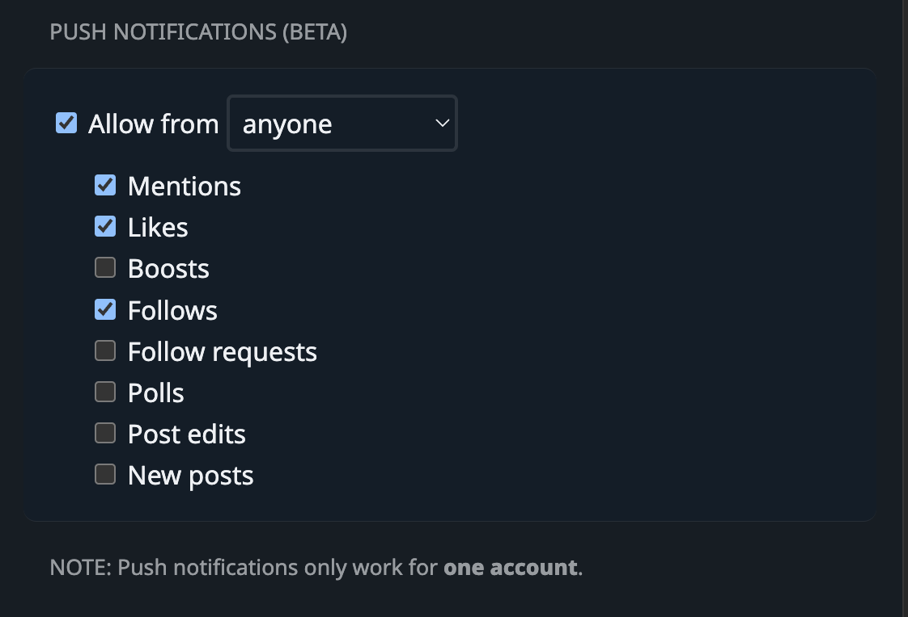

It's time for another round of dev delivery:

## Notifications

We're pleased to report that the [boom.army](https://boom.army) notification system is functioning optimally. It's been designed to keep you updated and engaged with the latest happenings. To enable notifications, navigate to the 'Settings' menu and look for the 'Notifications' option. Here, you can customize your preferences to suit your needs. Remember, staying notified helps you stay in the loop and enhances your experience with our platform.

## Enhancements

We've made a necessary change to disable the [boom.army](https://boom.army) switch post menu if there's no post instance yet. This should prevent any unexpected behavior when interacting with the interface.

We've also made a small but meaningful change, replacing '[Calckey](https://calckey.world/)' with '[Firefish](https://joinfirefish.org/)'. It's a small detail, but one that adds a touch of personality to our project.

In our quest for perfection, we realized we still needed the tilde (~). It's back in its rightful place now.

## Experimenting



In the laboratory of innovation, we've been tinkering with the idea of displaying play progress for those lengthy GIFs. This little tweak is aimed at enriching your media interaction experience on our platform.

On the upgrade front, we've given our dependencies a facelift and transitioned to the sleek Vite 5 build pack. This move is set to streamline our development process, making it more efficient.

And for those who appreciate the subtleties, we've swapped out the old icon for a fresh one to hint at comments. This change is all about enhancing visual cues within the interface.

## Testing and Fixes

We've been testing a new instance of [Lingva Translate](https://lingva.ml/) for translating [boom.army](https://boom.army) posts. We're always looking for ways to improve and expand our features, and this is part of that ongoing effort.

We've also addressed a couple of issues that were affecting user experience. We fixed an issue where missing posts were due to GC, and another where the menu was blocking everything for the Boost button.

## Final Touches

We've upgraded the [boom.army](https://boom.army) Menu generally, and upgraded the text expander element. 

That's all for now. As always, we're committed to improving and enhancing your experience. Thank you for being part of our community.

Until next time, happy coding!

## The delivery in code stats

- **Files changed:** 43
- **Lines added:** 1067
- **Lines removed:** 6791

Until we meet IRL - [harkl](https://boom.army/#/social.boom.army/a/110693550018915728)