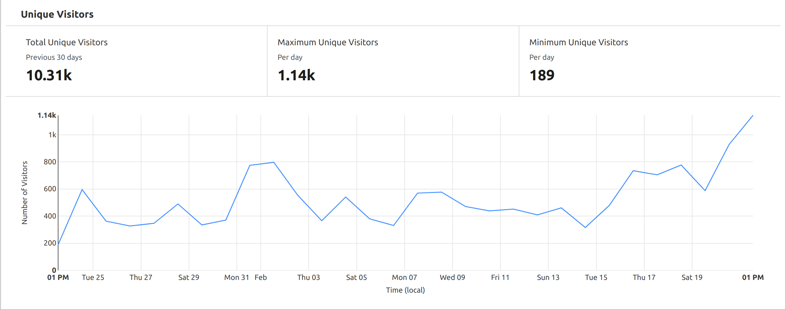

Going to keep this short and snappy @everyone so you can get max info for minimum time spent:

- Boom.Army is in the process of being funded! A very well known VC wants to bulk buy $BMA and some 1303 OG NFTs OTC (direct from us)
- Dingo is talking to other VCs and on the back of our first funding we're in a strong position to negotiate
- Harkl has written the first draft of the "Seasons" brief (see attached). We're still figuring out the language on this so any feedback appreciated.
- We've hired two absolutely amazing artists to realize Season passes and the first 4 action cards that will be available in Season 1
- Boom.Army now has hover states to see who liked a Meep
- We saw 1.14K unique vistors on the site this week which is a new record 🎉
- 340 hodlers now have [$BMA in their wallets](https://birdeye.so/token/boomh1LQnwDnHtKxWTFgxcbdRjPypRSjdwxkAEJkFSH)
- We're still in the process of figuring out how to airdrop the testnet SSL to accounts. We've got some ideas but it might be delayed a little longer.
- The build of NFT driven Community spaces has started
- Our BMA/USDC farming pool now has 30K [TVL and the current APR for farming is 112%](https://dex.aldrin.com/pools/BMA_USDC)

So huge week all in all and looking forward to shipping more alpha before the next report.
