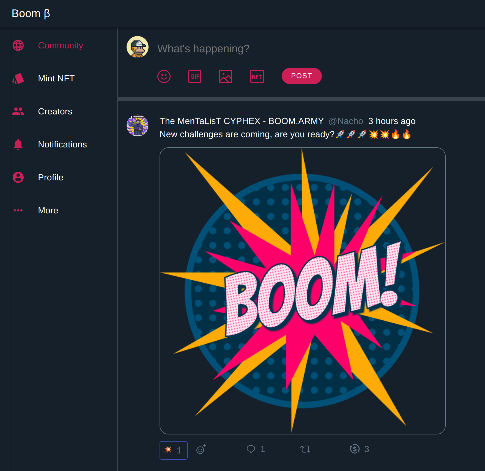
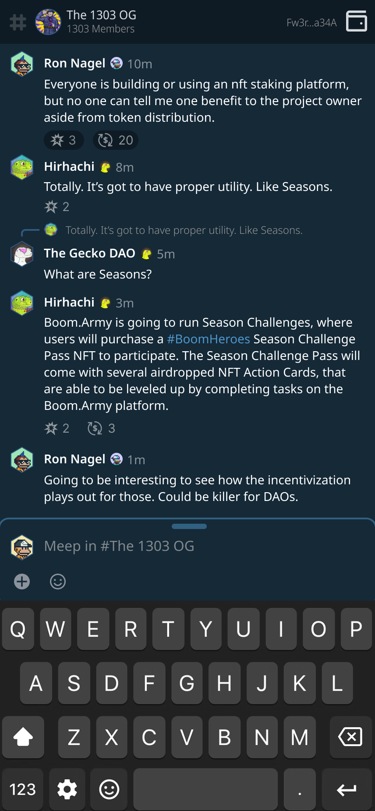

Those features that are built and read to go are:

- NFT Community DAO Channels
- The NFT minting tool - you can now mint NFTs to create your own DAO Communities

The third feature that we're currently finishing is:

- Comment threads for NFT Community DAO Channels

During the last few weeks while I've been building these out, I've realised a few things. Namely that we're going to end up with two different types of content threads.

## Content type 1

The first is akin to a Blog, Medium, Reddit or Twitter where users are making a top level post focused on content and users are looking for that content then commenting on the post. This is the beta structure that we’ve got roughly built out in our Global Channel at the moment. It warrant’s a very specific approach to the UX, and it’s why when you look at all these sorts of sites, the wysiwyg to add content is typically position above the other content in the top of the screen.

## Content type 2

The second content type is related directly to Community DAO Channels and a more message based chat experience. This is closer in style to any messaging app you're using like WhatsApp or Telegram. The content flow is bottom up and the input box is located at the bottom of the page to reflect the more conversational nature of the chat.

So I've reworked the channel design to reflect this:

## Where to from here?

From here we're going to be taking a distinct approach to both types of content. We want to be the best of both worlds described in the types of content above, all wrapped up on-chain with Solana NFTs driving our platform. We're going to take distinctly different approaches to the UX to reflect this.

We'll be implementing the Comment threads design above, and then deploying all three pieces of functionality together, as they're complimentary.

- NFT Community DAO Channels
- The NFT minting tool - you can now mint NFTs to create your own DAO Communities
- Comment threads for NFT Community DAO Channels

We're hoping this is going to cause quite a stir, just in time to promo our [Boom Heroes NFT](https://boom.army/docs/docs/prologue/season-challenges/) Season Challenges.

## Other things we've shipped this week

- Produced a couple of dope video promos [here](https://twitter.com/boom_army_/status/1504635740801896448?s=20&t=pwrAlcNezC_SCFksS-yJdw) and [here](https://twitter.com/boom_army_/status/1504573388396044288?s=20&t=pwrAlcNezC_SCFksS-yJdw)
- Completed the [Boom Heroes NFT](https://boom.army/docs/docs/prologue/season-challenges/) elements (we're in the process of reworking these with a second artist as the quality needed improving)
- [Launched Boom.Army docs for all info detail](https://boom.army/docs)
- [Launched a Boom.Army blog](https://boom.army/docs/blog/)
- [Created a linktree page for all our links](https://linktr.ee/boom_army)

Until next week folks!