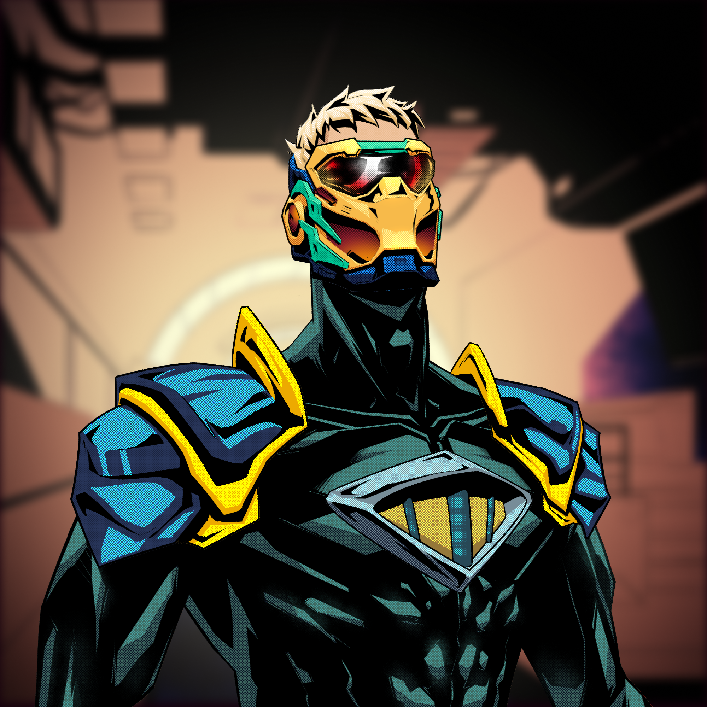

Today is day 8 for me, and while the overall experience has been pretty much just low energy and mild flu symptoms, I've spent most of the week in bed asleep, eating chicken soup, and dosing up on Vitamins. Hence the late entry for the dev diary and no real updates in terms of dev delivery.

In spite of that we have a few things to report, especially as we gear up towards the launch of the Boom Heroes Season Challenges that are getting very close. All of the colored generative elements are functionally complete. In fact we'll be launching the first Season on April 15 in just 2 weeks.

For a full breakdown of what Season Challenges are and how they'll work [see the Wiki](https://docs.boom.army/prologue/season-challenges/). But the TLDR is as follows:

- Launch date April 15
- 4777 Boom Heroes Season Challenge Passes available
- Season Challenge Pass Cost: 0.5 SOL
- Season 1 Challenge Passes will act as Passes for ALL future Season Challenges
- Future Season Challenge Passes will only be valid for a single Season
- There are 3 Complimentary Action Card NFT Challenges
- There is one pay to play Action Card NFT Challenge

## SSL airdrop redemption

The value of testnet SSL that we airdropped during Alpha on the platform is going to be honored with the launch of the Boom Heroes Season Challenge One. Here's the breakdown of the plan:

### The challenge of converting SSL to BMA

When we airdropped testnet tokens 5 months ago to The 1303, our original intent was to deliver the equivalent of 100 USD to our early adopters. We airdropped 10k tokens to The 1303 list, which put the unofficial price of the SSL token at 0.01 USD. The process of launching tipping and how it worked was a big learning curve, and with the launch of $BMA to mainnet we adjusted our strategy for the token price to launch at 0.1 USD with a market cap of 420M tokens. We felt this was a good balance that would be attractive to investors with a realistic valuation, and be a useful as price point for the transactional token and on platform tipping. Unfortunately this disconnected the original SSL intent from the BMA Mainnet token, and it's given us quite a headache trying to figure out the best way to reward our loyal early stage community with agreed value, whilst retaining liquidity in the token and not crashing the token price. So we've come up with a solution:

### The solution for claiming SSL redemption

For every 5000 SSL, we're going to give you a Whitelist token to mint 1 complimentary Boom Hero Season Challenge Pass. This means that every member of the 1303 will receive 2 Whitelist tokens each, and 2606 Boom Heroes will be potentially minted at no charge. It takes out a big chunk from our potential revenue which is vitally important for us as we start to hit some scale, but we are committed to being a team that delivers with integrity and makes good on what we say we're going to do. It also honors the original intent to reward early adopters with the equivalent of 100 USD approx, not to mention the ability to accrue future value for hodling a Season One Challenge Pass.

Given that the Season One Challenge Passes will be valid for all future Season Challenges, we are giving all of The 1303 access to the Challenges in perpetuity should they choose to hold onto their NFTs.

Best of all holding a Season 1 Challenge Pass will give you access to the corresponding Message DAO on boom.army. You'll be able to jump into the chat and connect with other hodlers. It'll be a fun and unique experience.

Please note, that the conversion of Testnet $SSL to WL tokens for the Boom Heroes Season Challenge Passes is a one time offer. Any unclaimed WL tokens or Testnet $SSL will become void at the end of Season One, and no further claims will be able to be made.
