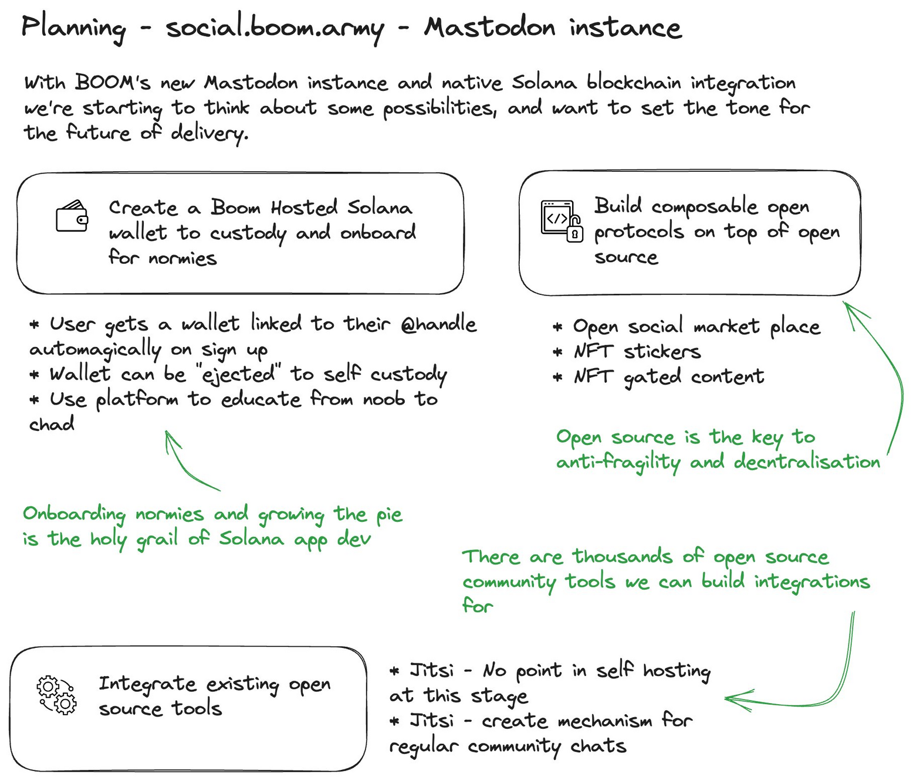
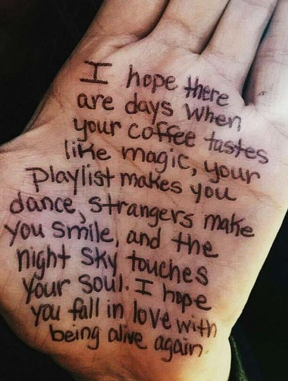

Over the last few months I've noticed that my reach and voice has got smaller and smaller. It seems like a common story for many too, as I can no longer connect with and keep track of all the Solana peeps that I used to know and love. I'm not sure we realise how big a point of failure Twitter is for the Solana community as a whole. But it's increasingly hard to keep up with new developments in the Solana space on the Xird App. Either that or the devs and community are falling away on the back of the NFT grifts, gambling and a lack of a strong voice from the Foundation. Generally, it's hard to get a scientific read on it - whatever the case the vibe is definitely dead for me RN.

## We are in love with our captors

In 1973, a hostage crisis in Stockholm, Sweden, led to a curious observation. Victims of this harrowing event began showing empathy towards their captors, forming inexplicable emotional bonds. This surprising psychological reaction, now known as Stockholm Syndrome, is when the imprisoned or abused paradoxically find solace in the very people causing their trauma. It's a perplexing scenario that unfolds in oppressive environments, from abusive relationships to cult indoctrinations. What may seem like the softening of a captor's abusive act, can be, in fact, a survival instinct of the victim. It's another strange and wonderful output of the human condition, and it's my new working thesis for Twitters relationship with it's users.

## State of BOOM!

I started [boom.army](https://boom.army) in conjunction with [#Solana](https://boom.army/#/social.boom.army/t/Solana) to combat the rising tide of abuse from centralised platforms who take everything from their users and mortgage their data to the highest bidder. I thought I could provide a platform where people could own their accounts and maintain anonymity and that people would take notice; I thought people cared about decentralisation; but ultimately my thesis has proven to be wrong.

In spite of this I feel that the direction and implementation of [boom.army](https://boom.army) has now hit all the big goals I wanted to achieve from the outset:

* It's decentralised on [Mastodon](https://joinmastodon.org)
* It has an absolutely killer UX that is better than twitter IMHO
* It is completely built on top of open protocols and ALL the code is open source
* It houses the #BoomHeroes community

I've been thinking on the possibilities of what's next now that real decentralisation has been achieved. This is my current thinking as of today but there is no hard timeline for delivery:

Once again I'm working on assumptions, and unless I see uptake of the platform in the short term there seems to be no sense in actioning more dev when interest in the space is low and no one is clamouring for it to be built. 

This might change when the Bull Market comes back, but ultimately if I'm honest I'm tapped out and lacking direction for any future dev on Boom RN. 

## Where I'm looking for vibes

It's time to get balance back to my life after 2 of the most hectic years I've lived and focus on the real things in my life - family, friends, fitness, walking on the beach with my dog, going for long aimless rides with no planned destination and general analog activities.

I'm going to maintain the codebase for and be on [boom.army](https://boom.army) exclusively from here digging into the 2M+ strong Mastodon community with an open heart and mind. The core people I care about from Solana are on there, and it's nice to be in a place with a strong core of people I know and love where I have an equal footing in the fediverse with everyone else.

The old Boom site will be archived and everything built to date will be archived on [Boom's Github](https://github.com/boom-army).

Over the next few months as I recover from the last 2 years I'll most probably start hacking on my [Harkl](https://github.com/h4rkl) account again. I've got a few things in the back of my mind that I want to dig into that being a solo founder got in the way of. 

I'll be going to Breakpoint in November, and I'm looking forward to using it to put a cap on my time in Solana and meet all the amazing people I've interacted with and observed from afar. I'm still Bullish on the tech, the thesis, and most of all the people.

I'm not deleting twitter, and I'll probably check back in occasionally. I'm not on any other social media or public site. But, it's time to focus on being alive and withdraw further into the cypherpunk cave.

Thank you all for the journey. It's been real. I love you all.

Until we meet IRL - [harkl](https://boom.army/#/social.boom.army/a/110693550018915728)
