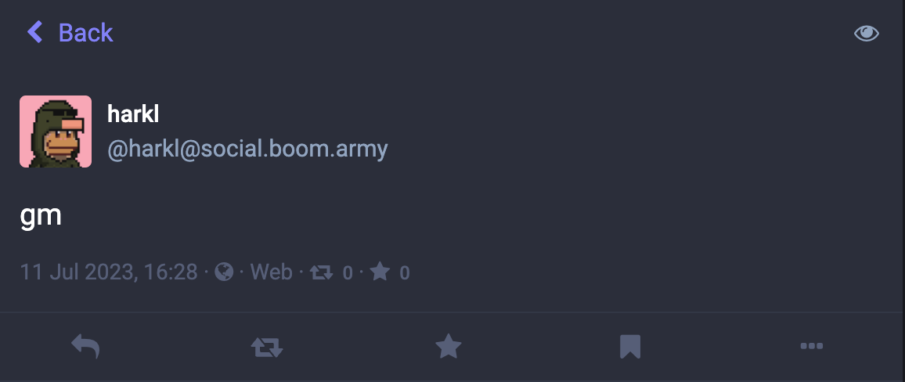
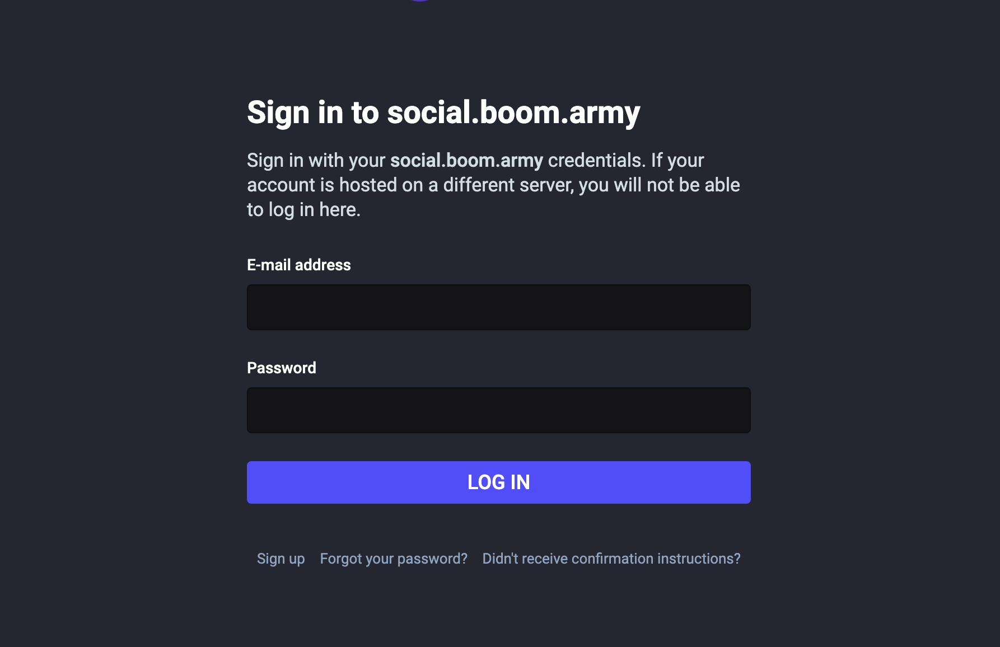
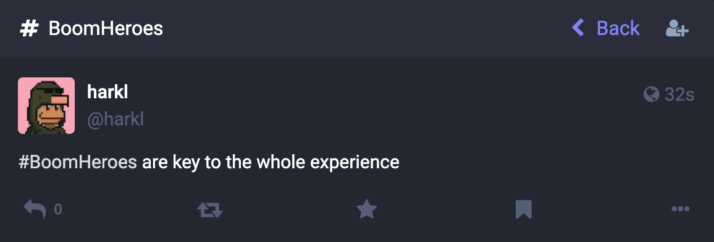

## Into decentralisation

As you all know one of the long term goals of [Boom](boom.army) is to have a decentralized social experience. By far my biggest bugbear with the app currently is that it runs a centralized postgres instance on AWS. Not ideal and not decentralised at all!

With the advent of [Threads](https://www.threads.net) choosing the open source federated social protocol [ActivityPub](https://en.wikipedia.org/wiki/ActivityPub) and the positive reaction from the Solana community around this I feel like decentralised social infra has a clear winner, and now is the time to embrace that specific technology. The obvious candidate for delivery of this is [Mastodon](https://joinmastodon.org) which has been around since 2016 and is mature and fully featured.

## Benefits of adopting ActivityPub

**We're going to get a tonne of stuff for free:** It's been a really difficult road as a single dev building out an open source social media app for Solana. The sheer amount of work required to get something that puts the viable in MVP for a social app has been a mammoth task. With no clear pathway to open adoption and an established decentralised winner in Mastodon, it's time to work smarter rather than harder. Mastodon has been in prod for several years, and the app is a fully featured competitor for the likes of Twitter and we can benefit hugely from that.

**You finally own your profile:** You can use your <name>@social.boom.army profile on any Mastodon server with any client to customise your own social experience. You'll retain all your follows and followers and no one will be able to take it away from you. This was what we have always dreamed about as a community.

**Solana will have it's FIRST decentralised social network:** Boom has talked a big game about this happening and it's finally here if all is positive with the DAO vote.

**We're going to bring Solana to ActivityPub:** There are huge opportunities for building out integrations between Solana and federated social. That's always been one of Boom's goals and we're going to be diving into head first.

## A master plan

So here's what I'd like to do:

1) **Trial the social app:** I've setup an instance of [Mastodon](https://joinmastodon.org) (which runs ActivityPub) for us to trial at **[social.boom.army](https://social.boom.army)**. For the trial we're all going to need to signup at **[social.boom.army/auth/sign_up](https://social.boom.army/auth/sign_up)** - note that all email addresses will be safely held by Boom on our own federated instance.
2) **Discuss and vote on [social.boom.army](https://social.boom.army):** We'll use the native voting system on our local Mastodon instance to make group decisions until the Modular Governance contract is setup and ready to use and we can vote on-chain using our wallets. Once we all feel we've had a good chance to trial the site I'll put up a final vote as determined by the DAO.
3) **Get ready for a whole suite of DAO tools**: Alongside video chat, we're now going to have another tool in social.boom.army. And this is just the start of a whole collection of tools that will allow DAOs across Solana to govern and grow their communities. All delivered and crowd-sourced by [#BoomHeroes](https://social.boom.army/tags/BoomHeroes)

## What this means for [boom.army/feed](https://boom.army/feed)

Nothing changes with the existing feed for now, but the unfortunate reality is that it's never really been fit for purpose in spite of having some great features like tipping, native Solana NFT posts, and native Solana NFT avatar integration. The long term plan is to implement these features and integrate them with ActivityPub - which is actually a much more compelling use case.

## What about #BoomHeroes?

[Boom Heroes](https://www.tensor.trade/trade/boomheroes) are the key to everything we're doing in the DAO membership, and we'll be discussing how we're going to use them on [social.boom.army](https://social.boom.army). In the medium term as long as the DAO agrees this is the right direction we'll be migrating many of the Solana integrations currently on [boom.army/feed](https://boom.army/feed) to [social.boom.army](https://social.boom.army).

## Where are we heading longer term?

Solana moves so fast that nothing is set in stone, but this whole approach feeds into a bigger plan we've been discussing in [#BoomDAO](https://social.boom.army/tags/BoomDAO). It's a problem that faces the whole of web3 that needs solving - How do we get normies to adopt web3 tools? I can't let on too much about where Boom is heading with this but I can tell you that it involves email accounts, and we'll be solving this as part of the suite of tools we're delivering.

Until we meet IRL - [harkl](https://social.boom.army/@harkl)
