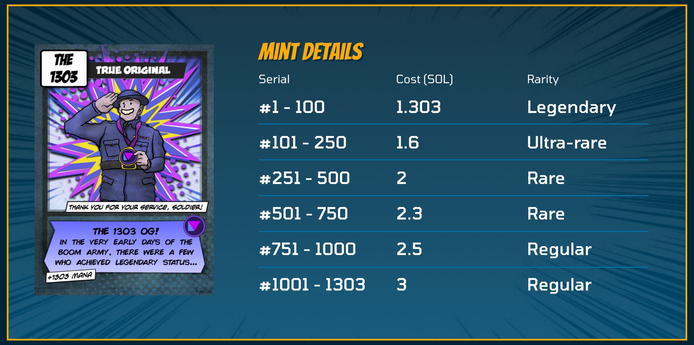

There are 1303 NFTs in total in existance, and they will receive a 1303 split share of 13.03% of our Market Place fee profits in perpetuity. They were minted on [boom.army](https://boom.army) during the month of February 2022.

## 1303 NFT Benefits

- 1303 split share of 13.03% of our Market Place fee profits in perpetuity
- First on platform Community DAO channel
- Bragging rights of being the first members on the first Solana Social platform

## White List tokens

All White List i3o3...3bos tokens minted at 1.303 SOL discount. All our Community Moderators in Discord had White List tokens to give away and they were distributed [in Discord](https://discord.gg/PmCNkDU5jJ) to our OG community members.

## The 1303 token rarities

There are 4 different rarities of 1303 OGs, and they originally minted at increasing amounts as the time preference ran out:

| Serial       | Rarity     | Original Cost (SOL) |
| ------------ | ---------- | ------------------- |
| #1 - 100     | Legendary  | 1.303               |
| #101 - 250   | Ultra Rare | 1.6                 |
| #251 - 500   | Rare       | 2                   |
| #501 - 750   | Rare       | 2.3                 |
| #751 - 1000  | Regular    | 2.5                 |
| #1001 - 1303 | Regular    | 3                   |

> NB: All rarity tiers receive the same split share of market place revenue.

## 1303 Road Map updated (Oct 22)

With the inception of the Boom Ones Auction House on us it's finally time for the 1303 to start receiving their royalties. It's been 6 months since we minted this collection which in the big scheme of things isn't that long, but in Solana it's an age. Being a lone founder is full of trade offs, and the fact that this functionality has been delayed longer than intended has been weighing on me. So it's with great pleasure that I can finally say LFG on the beginning of the Market Place! The end game in all this is to enable all users on Boom to have a permissionless way to sell their NFTs directly from their own Profile. And of course every single sale on platform will generate a small fee of which 13.03% of the profit will go to our OGs - #The1303! 

❤️ to you all.
