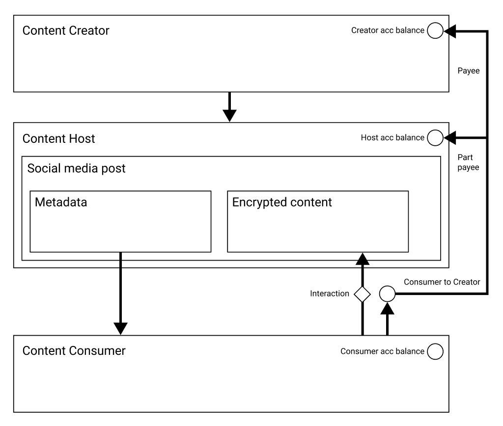
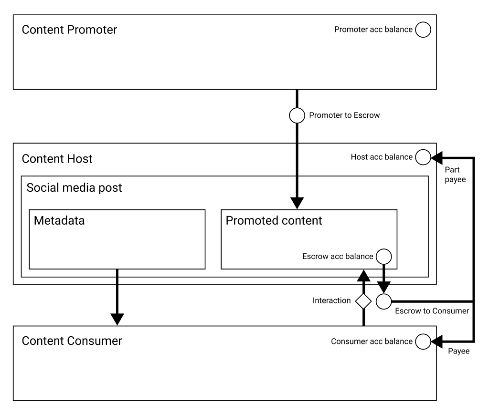

_NOTE: This document is under development. Please check regularly for updates!_

<!-- ## Table of Contents

- [Introduction](#introduction)
- [Design Principles](#design-principles)
- [Tokenomics](#tokenomics)
  - [Content Creator to Content Consumer (pull model)](#content-creator-to-content-consumer-pull-model)
  - [Content Promoter to Content Consumer (push model)](#content-creator-to-content-consumer-push-model)
- [Conclusion](#conclusion) -->

## Introduction

Social Media has been a primary driver of the Web2 era. Large centralized organizations have grown up on the back of social media platforms, typically offering a free experience for users to share their data with each other. The shared data provided by users is then stored on central servers and monetized by the same organizations, and through this model many of those companies have grown to become some of the largest most profitable companies in the world. The users who provide that data to the organization at no cost, typically have a low opportunity to monetize their content through the platform. This is the environment boom.army has an opportunity to disrupt.

[Solana](https://solana.com) provides a platform for moving away from a Consumer-to-business (C2B) model, towards a Consumer-to-consumer (C2C) driven social platform. By signing content with public/private keys, Content Creators are able to post and upload content with provable ownership. Through the same mechanism Content Consumers can engage that content for a small fee, and a smart contract sits in between the two parties to facilitate the terms and fees associated with that engagement.

It was [Melvin E. Conway](https://en.wikipedia.org/wiki/Conway%27s_law) who stated that "Any organization that designs a system (defined broadly) will produce a design whose structure is a copy of the organization's communication structure." By shifting the social media landscape from C2B to C2C and removing third parties from engagement, there is an opportunity to align social media toward a more human centric organizational model. Mirroring real world interaction where peers communicate directly with one another and transact value accordingly is the primary driver of **boom.army** and it's delivery road-map.

## Design Principles

The aim of **boom.army** is to consistently facilitate human centric communication, through decentralization of the entire platform making content creation and consumption a democratic process governed by tokenomics.

Here are the design principles of **boom.army**:

1. **Democratic engagement**: The platform should enable every account to post textual content in a self-sovereign manner, without fear of removal, censorship or exorbitant cost in a peer to peer context.
2. **Open source**: All non-sensitive production code should be open and transparent, available for anyone to audit and improve **boom.army**. The repository where this code is housed is on [github/boom-army](https://github.com/boom-army).
3. **Open data**: The long term goal for **boom.army** is to enable open access to all online data by way of a decentralized API. The onus should be on the user to decide which data is encrypted, and which is public.
4. **Speed**: [Solana](https://solana.com) specifically provides the ability for a rich online experience with high throughput (65k+ TPS), long term scalability, micro-transactional appropriate fees (< $0.001 USD) and near immediate transaction finality (400 ms).
5. **Monetized content**: Valuable content should be able to find a real world market value on **boom.army**, where Consumers are free to operate in a free market to consume that content.

## Tokenomics

The **boom.army** token for engaging with the **boom.army** program on main-net is [boomh1LQnwDnHtKxWTFgxcbdRjPypRSjdwxkAEJkFSH](https://explorer.solana.com/address/boomh1LQnwDnHtKxWTFgxcbdRjPypRSjdwxkAEJkFSH).

### Content Creator to Content Consumer (pull model)

The program should enable Content Creators to attach value to their content on creation. The Content Consumer should be able to view basic post meta-data without making a transaction, but specific interactions should trigger a transaction for encrypted content engagement. This should generate a payment from the Consumer to the Creator with a small portion of the fee being split out for the Content Host. The specific interaction micro-transaction is determined by the platform, but could cover a wide variety of scenarios from emoji reactions to consuming rich media.

### Content Promoter to Content Consumer (push model)

The program should enable Content Promoters (eg. advertisers) to promote their content within the platform. Consumers should be paid out directly from the content escrow account that lives in the **boom.army** program. Promoters should be able to attach value to any post on creation, by depositing into the program escrow account, a fixed amount of **boom.army** tokens to be distributed in discrete amounts limited by any Consumer account address. When a transaction is executed, the tokens associated with the post should be paid out at the specified rate and ratio to the Consumer and Host.

## Conclusion

This proposal outlines the initial features and intent for delivering decentralized social media on the Solana blockchain. It covers the core design principles of such a platform, and the direction for the project. The tokenomics are designed to benefit Content Creators through Content Consumers, with an incentive for Content Hosts to persist data. This demonstrates the ingress point for moving towards a fully decentralized, democratic, transactional social media platform.
